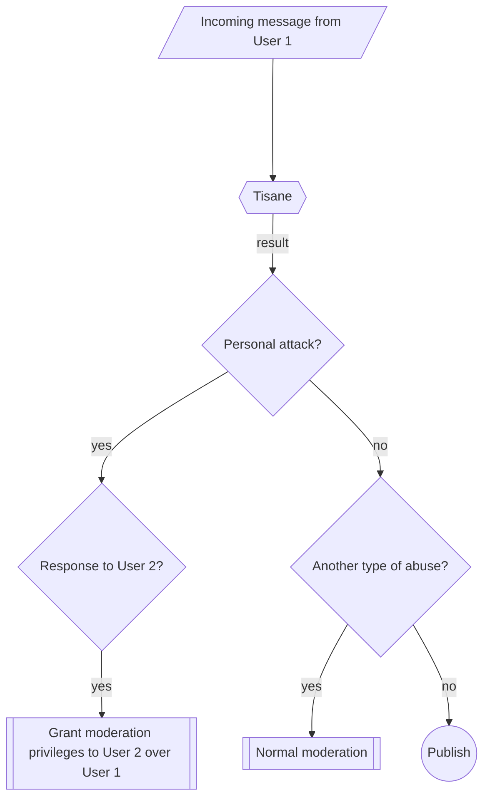

# ユーザー参加型モデレーションについて

ユーザー参加型モデレーションは、ゲーム内のコミュニケーションなど、通信量の多い、リアルタイムなチャット向けに設計されたクラウドソーシング型モデレーションの手法です。これは2要素認証（2FA）と同様に、モデレーションの判断を下すために2つの独立した入力を要求します。 

## ユーザー参加型モデレーションの必要性とは
- リアルタイムチャットはしばしば有害なものになり、ユーザーを離脱させます。
- リアルタイムチャット専任の人間のモデレーターを雇用することは、コストが高く、多くの場合現実的ではありません。
- 手動でチャットのモデレーションを行うことは、モデレーターにとって不評で精神的に疲弊する作業です。
- 一方、自動モデレーションには誤検出が発生するおそれがあります。

注意：ユーザー参加型モデレーションは、他のユーザーを標的としたモデレーションタイプ（例：個人攻撃（侮辱、ネットいじめ））の場合にのみ動作します。

## ユーザー参加型モデレーションの仕組み
1. Tisaneは、他のユーザーを標的とした個人攻撃を含むメッセージにフラグを立てました。
2. 対象ユーザーには、違反者に対する罰則措置（例：ミュートまたはBAN）を承認するための一時的なモデレーション権限が付与されます。
3. Tisaneが誤検出し、メッセージが実際には侮辱的なものでない場合、対象ユーザーは中止を選択する可能性が高いです。実際に侮辱なものである場合、攻撃者にはペナルティが与えられます。

個人攻撃が中傷の90%以上を占めるため、このアプローチは人間によるモデレーションの作業量を大幅に削減します。このシステムはまた、抑止力としての役割も果たします。荒らしを行う者は、被害者がすぐに報復できることを知っている場合、他人を攻撃する可能性が低くなります。

個人攻撃に該当しないコンテンツに対しては、通常のモデレーションフローが適用されます。 

## ユーザー参加型モデレーションのプロセス

```mermaid
flowchart TD
  input[/Incoming message from User 1/]
  tisane{{Tisane}}
  isPersonalAttack{Personal attack?}
  isResponseToUser2{Response to User 2?}
  isAnotherAbuse{Another type of abuse?}
  normalModeration[[Normal moderation]]
  grantPrivileges[[Grant moderation privileges to User 2 over User 1]]
  publish((Publish))
  input---->tisane
  tisane-- result -->isPersonalAttack
  isPersonalAttack-- yes -->isResponseToUser2
  isResponseToUser2-- yes -->grantPrivileges
  isPersonalAttack-- no -->isAnotherAbuse
  isAnotherAbuse-- yes -->normalModeration
  isAnotherAbuse-- no -->publish
```

## 考えられるシナリオと結果

#### シナリオ1：モデレーションの成功

1. ユーザー1がユーザー2を侮辱します。

2. Tisaneはこれを個人攻撃としてフラグを立てます。
3. ユーザー2に一時的なモデレーション権限が付与され、ユーザー1をBANします。

#### シナリオ2：誤検出への対応

1. ユーザー1が投稿したコメントが誤って中傷的なものとしてフラグが立てられました。

2. ユーザー2はモデレーション権限を付与されましたが、実際の攻撃が発生しなかったため、措置を講じることを選択しませんでした。

#### シナリオ3：ヘイトスピーチまたはその他の違反行為

1. ユーザー1が差別的または広範な対象を標的とした中傷的なコンテンツを投稿しました。

2. Tisaneはそれを偏見と分類します。
3. 標準的なモデレーションプロセス（当該コンテンツを人間のモデレーターに送信など）が適用されます。

## ユーザー参加型モデレーションのメリット

- 人間のモデレーターへの依存度を低減しつつ、効果的なモデレーションの実施を維持します。
- 自主規制を促進し、他人を攻撃する荒らしを抑制します。
- 最終的に行動するかどうかは対象ユーザーが判断するため、誤検出を最小限に抑えます。

