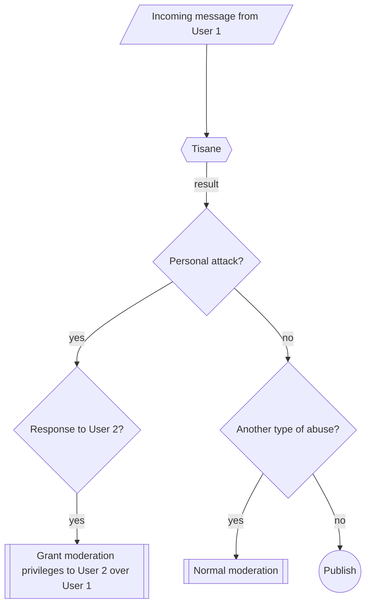

# About 2-Factor Moderation

2-Factor Moderation is a crowdsourced moderation approach designed for high-traffic, real-time chats, such as in-game communication. It works similarly to [2-Factor Authentication](https://en.wikipedia.org/wiki/Multi-factor_authentication), (2FA) by requiring two independent inputs to make a moderation decision.

## Why Is It Needed?
- Real-time chats often become toxic, driving users away.
- Hiring dedicated human moderators for real-time chats is expensive and often impractical.
- Moderating chat manually is an unpopular and mentally exhausting task for moderators.
- On the other hand, automatic moderation may have false positives.

Note that 2-factor moderation only works for moderation types when another user is targeted, e.g. personal attacks (insults, cyberbullying).

## How 2-Factor Moderation Works
1. Tisane flags a message as containing a personal attack targeting another user.
2. The targeted user is granted temporary moderation privileges to approve a punitive action against the offender (e.g., muting or banning them).
3. If Tisane's detection misfired, and the message, in fact, is not an insult, the targeted user will likely choose to abort. If it is indeed an insult, the attacker will be punished.

Since personal attacks make up 90%+ of abuse, this approach significantly reduces human moderation workload. This system also acts as a deterrent. Trolls are less likely to attack others when they know their victim can immediately punish them.

For content that is not a personal attack, standard moderation workflow applies. 

## 2-Factor Moderation Process

## Possible Scenarios And Outcomes

#### Scenario 1: Successful Moderation

1. User 1 insults User 2.

2. Tisane flags it as a personal attack.
3. User 2 is granted temporary moderation privileges and bans User 1.

#### Scenario 2: False Positive Handling

1. User 1 posts a comment that is mistakenly flagged as abusive.

2. User 2 is given moderation privileges but chooses not to take action since no real attack occurred.

#### Scenario 3: Hate Speech Or Other Violations

1. User 1 posts bigoted or otherwise broad-targeted abusive content.

2. Tisane classifies it as bigotry.
3. Standard moderation processes apply, such as sending the content to human moderators.

## Benefits Of 2-Factor Moderation

- Reduces reliance on human moderators while maintaining effective enforcement.
- Encourages self-policing, discouraging trolls from attacking others.
- Minimizes false positives, as the targeted user ultimately decides whether to act.

