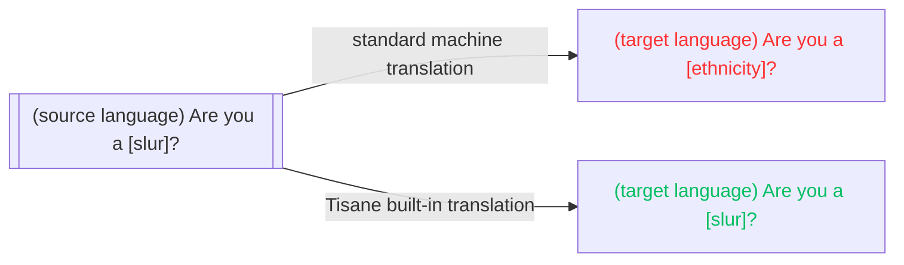

# 組み込み翻訳

Tisaneは、主に説明のための機械翻訳機能を提供しています。この翻訳は、解析目的で使用されるのと同じ言語モデルを使用しているため、一貫した結果が保証されます。 

翻訳を使用するには、`POST /transform`を呼び出します。レスポンスは平文（元の発言の翻訳）です。

参考：[テキストの翻訳](/apis/tisane-api-short/nlu-nlp-methods/transform)。

## 標準的な機械翻訳とTisaneの機械翻訳の比較

標準的な機械翻訳エンジン（Google 翻訳、Microsoft Translator、DeepL）は、主にコンテンツを翻訳して公開するために使用されます。最先端のエンジンは、多彩なコンテンツに対応できる一方で、卑猥な言葉や差別的な表現については、ごく少量のデータでしか訓練されていません。商業的な理由から、主に技術文書、科学文書、公式発表、またはニュースの翻訳に利用されています。

スキャンダルや訴訟を回避するため、差別的表現や卑猥な言葉は優先度が低く、可能であれば削除されます。多くの場合、依頼文には本来含まれていない「please（〜ください）」が付け加えられます。

つまり、**感情的な要素は保持されていない**ということです。例えば、原文に差別的な表現が含まれていた場合、標準的な機械翻訳ではその表現は翻訳されない可能性が高いです。標準的な機械翻訳を使用する国際的なコミュニティのモデレーターは、スタイルが変更されると、人々の反応を理解するのに苦労するでしょう（比較：「[民族]？」 と 「[差別]？」）。

もう一つの問題は、標準的な機械翻訳は難読化された単語を適切に処理できない点です。 

そのため、Tisaneはコンテンツモデレーションと法執行機関のニーズに対応した機械翻訳を開発しました。

* Tisaneの機械翻訳は原文の感情的な要素を保持し、ソース言語の差別的な表現や卑猥な言葉は、ターゲット言語の差別的な表現や卑猥な言葉に翻訳されます。
* Tisaneの機械翻訳は、スラングを解読できます。これは、同じ解析プロセスを採用しているためです。



## 例

リクエスト：

```json
{
  "from": "fr",
  "to": "en",
  "content": "tu es une taspe",
  "settings": {}
}
```

レスポンス：
```text
you are a bitch
```