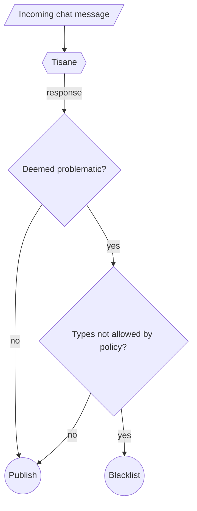

# Moderating Live Chat

Tisane is widely used to moderate live communications between users on group instant messaging platforms. Usually, in live chats Tisane runs in fully automatic mode. 

If false positives is a sensitive issue, then an appeal procedure and human review (on request) can be established.

## Standard Integration Architecture

As shown on the diagram below: a simple integration architecture scans every message and blacklists or sends the message to a special channel if it is deemed problematic and the policies do not allow the type of `abuse` that was detected.

1. The client application sends posts to Tisane for scanning.
2. Tisane flags posts based on severity level and abuse type.
3. The client application then must check if the types of entries logged in the `abuse` section are not allowed by the community policies.
4. If there are restricted types, then the post is blacklisted. (Presumably, the post is sent to a special channel for moderators. For maintenance reasons, it is not recommended to discard messages without a trace.)
5. If there are no restricted types or there is no `abuse` section in Tisane's response, the post is published.

## Open-Source Integrations

Our partner PubNub built a content moderation demo seamlessly integrated with Tisane and published its source code in GitHub. The implementation allows the users dynamically set community moderation policies. 

- [PubNub Moderation Dashboard for Chat](https://www.pubnub.com/demos/moderation-dashboard/)
- [pubnub/moderation-dashboard on GitHub](https://github.com/pubnub/moderation-dashboard)

## Integrations with Popular platforms

See: [Integrations - Tisane Labs](https://tisane.ai/integrations)

