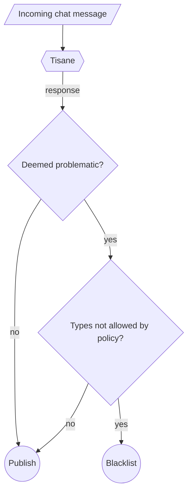

# ライブチャットをモデレートする

Tisaneは、グループインスタントメッセージプラットフォームでのユーザー間のライブコミュニケーションをモデレートするために広く使用されています。通常、ライブチャットでは、Tisaneは完全自動モードで動作します。 

偽陽性が微妙な問題である場合は、申し立て手続きと（要求に応じて）人による審査を行うことができます。

## 標準統合アーキテクチャ

下図に示すように、単純な統合アーキテクチャでは、問題があると判断された場合や、ポリシーで検出された`不正使用`のタイプが許可されていない場合に、すべてのメッセージをスキャンし、メッセージをブラックリストに登録するか、特別なチャネルに送信します。

```mermaid
flowchart TD
  input[/Incoming chat message/]
  tisane{{Tisane}}
  isAbuse{Deemed problematic?}
  hasRelevantTypes{Types not allowed by policy?}
  blacklist((Blacklist))
  publish((Publish))
  input-->tisane
  tisane-- response -->isAbuse
  isAbuse-- no -->publish
  isAbuse-- yes -->hasRelevantTypes
  hasRelevantTypes-- yes -->blacklist
  hasRelevantTypes-- no -->publish
```

1. クライアントアプリケーションが、投稿をスキャンするようTisaneに送信します。
2. Tisaneは、重大度レベルと不正使用のタイプに基づいて投稿にフラグを付けます。
3. 次に、クライアントアプリケーションは、 `abuse`セクションに記録されたエントリーのタイプがコミュニティポリシーによって許可されているかどうかをチェックします。
4. 制限されたタイプがある場合、その投稿はブラックリストに登録されます。（おそらく、投稿はモデレーター用の特別なチャネルに送られます。保守上の理由から、トレースなしでメッセージを破棄することは推奨しません。）
5. 制限されたタイプがない場合、またはTisaneからのレスポンスに`abuse`セクションがない場合、その投稿は公開されます。

## オープンソースインテグレーション

当社のパートナーであるPubNubは、Tisaneとシームレスに統合されたコンテンツモデレーションデモを構築し、そのソースコードをGitHubで公開しました。この実装により、ユーザーはコミュニティのモデレーションポリシーを動的に設定できます。 

- [チャット用PubNubモデレーションダッシュボード](https://www.pubnub.com/demos/moderation-dashboard/)
- [GitHub上のpubnub/モデレーションダッシュボード](https://github.com/pubnub/moderation-dashboard)

## 人気の高いプラットフォームとの統合

参考：[統合 - Tisaneラボ](https://tisane.ai/integrations)

