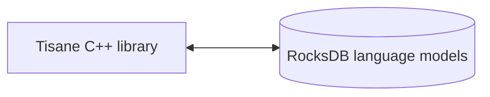

# Tisane Embedded C/C++リファレンス

## 概要

本ガイドは、C/C++アプリケーション用のTisane Embedded SDKで利用可能なメソッドのリファレンスを提供します。 

### コンポーネント

内部で、TisaneランタイムがRocksDBストアに格納されたTisane言語モデルと直接通信します。外部のデータベースエンジンを使用したり、インストールしたりする必要はありません。



#### バイナリ

##### Windows

- ランタイムライブラリ：
- 
  - `libTisane.dll`: Tisaneのコアランタイム。
  - `libgcc_s_seh-1.dll`: 標準POSIX C/C++ライブラリ。
  - `libstdc++-6.dll`: 標準POSIX C/C++ライブラリ。
  - `libwinpthread-1.dll`: 標準POSIX C/C++ライブラリ。

##### Linux

- Tisane：Tisaneのコア実行可能ファイル。

#### 言語モデル

参考：[言語モデルデータストア](./languagemodels.md) 

## 必要事項

### プラットフォーム

#### Windows
Windows 10+ (64-bit)



それ以前のバージョンのWindowsでも動作する場合がありますが、公式にはサポートされていません。 



#### Linux

Kernel バージョン6.0.0+

### RAM

**遅延読み込み**: 50 Mb固定 + 50～100 Mb（言語モデルあたり）

**完全読み込み**: 400 Mbから2 Gbの間（言語モデルあたり）

もっと読む：[遅延読み込みと完全読み込みの比較](./lazyloading.md)

## インテグレーション

### 基本ワークフロー

1. `SetDbPath` – データパスを設定する。
2. `LoadAnalysisLanguageModel` – 希望の言語モデルを読み込む。
3. `Parse` – テキストをパースする。

### 設定と使用

1. ヘッダーファイルを含める：  
  *  C/C++プロジェクトに必要なヘッダーファイル（[`tisane.h`](./tisane.h)）を必ず含めてください。 
  *  このファイルには関数宣言が含まれます。

2. アプリケーションをTisaneライブラリ（ `tisane.so`または`libTisane.dll`など）とリンクしてください。  

3. 初期化する：

  * データパスを設定する： 

      *   *最初に*行う呼び出しは*必ず*`SetDbPath`にしてください。  
      *   これがSDKに言語モデルデータファイルの場所を指示します。

  *   言語モデルを読み込む：  
      *   `LoadAnalysisLanguageModel`を呼び出して、希望の言語モデルを読み込んでください。  
      *   `SetDbPath`の*後*に呼び出します。
      *   特に大きなモデルの場合、言語モデル全体の読み込みには時間がかかることがあります。
  *   変換（翻訳など）を計画している場合は、生成言語モデルを読み込む：
      *   `LoadGenerationLanguageModel`を呼び出して、ターゲット言語の希望の言語モデルを読み込んでください。 
4.   処理：
  *   テキストをパースする： 
    *   `Parse`関数を使用して、指定した設定を使用するテキストをパースする： 
        *   `language`: 標準ISO-639-1言語コード（例："en"、"zh-CN"）、バーティカルバーで区切られた言語コードのリスト、または`*`自動検出用。
        *   `content`: パースするUTF-8テキスト。
        *   `settings`: 設定を含むJSON文字列。（参考：[レスポンスおよびコンフィギュレーションガイド](../apis/tisane-api-response-guide.md)）。`
        *   `Returns`: JSON文字列（参考：[レスポンスおよびコンフィギュレーション](../apis/tisane-api-response-guide.md)ガイド）。
    
  *   言語の検知： 
    *   `DetectLanguage`関数を使用して、与えられたテキストの言語を識別する。
        *   `content`: UTF-8テキスト。
        *   `likelyLanguages`：（オプション）予想される言語。
        *   `segmentDelimiter`: （オプション）テキストセクションを区切り、言語を検出。デリミターを明示的に指定しなくても異なる言語を検出することはできますが、デリミターによって結果をさらに制御することができます。
        *   `Returns`: 検知される言語コード。
    
  *   テキストを変換する：  
    *   文字列をある言語から別の言語に翻訳したり言い換えたりするには、`Transform`関数を使用する。 
        *   `sourceLanguage`: 標準ISO-639-1言語コード（例："en"、"zh-CN"）、バーティカルバーで区切られた言語コードのリスト、または`*`自動検出用。
        *   `targetLanguage`: 翻訳する言語のコード、またはバーティカルバーで区切られた言語コードのリスト。
        *   `content`: 変換する UTF-8 テキスト。
        *   `settings`: JSON文字列。
        *   `Returns`: 1つのターゲット言語が指定されている場合は、変換されたテキスト。複数の言語が指定されている場合は、翻訳を含むJSON配列。


こちらも参照： 

- [APIレスポンスおよびコンフィギュレーションガイド](../apis/tisane-api-response-guide.md)


## 関数リファレンス

### SetDbPath

```cpp
__stdcall void SetDbPath(const char *dataRootPath);
```

言語モデルデータファイルのルートパスを定義します。この関数は、他のTisane SDK関数が使用される前に呼び出される必要があります。

* `dataRootPath`: 言語モデルデータを含むディレクトリへの絶対パスまたは相対パスを表すnull終端C文字列。

戻り値： 

なし。

例：

```cpp
SetDbPath("C:\\Tisane");
```
### LoadAnalysisLanguageModel

```cpp
__stdcall void LoadAnalysisLanguageModel(const char *languageCode);
```

`Parse`メソッドや`Transform`メソッドのソース言語として使用する言語モデルを読み込みます。

パラメータ：

* `languageCode`: 言語コードを表すnull終端C文字列。例：`"en"`が英語、 `"es"`がスペイン語。

戻り値： 

なし。

例：

```cpp
LoadAnalysisLanguageModel("en");
```
### LoadGenerationLanguageModel
```cpp
__stdcall void LoadGenerationLanguageModel(const char *languageCode);
```

翻訳や言い換えなどのテキスト生成タスクのターゲット言語モデルとして使用する言語モデルを読み込みます。



生成モデルは常に遅延モードで読み込まれます。



パラメータ：

* `languageCode`: 言語コードを表すnull終端C文字列。

戻り値： 

なし。

例：

```cpp
LoadGenerationLanguageModel("fr"); // Load French for translation
```

### LoadCustomizedAnalysisLanguageModel
```cpp
__stdcall void LoadCustomizedAnalysisLanguageModel(const char *languageCode, const char *customizationSuffix);
```

カスタマイズされた言語モデルを読み込みます。これにより、ベースとなる言語モデルをドメイン固有の語彙やロジックで拡張することができます。カスタム言語モデルはメイン言語モデルと一緒に実行され、メインモデルの定義よりも優先されます。

パラメータ：

* `languageCode`: 基本言語モデルの言語コード。

- `customizationSuffix`: 特定のカスタマイズアドオンモデルを識別する接尾辞。SDKは、現在のルートフォルダーの下にある指定された名前のフォルダーを探します。

戻り値： 

なし。

例：

```cpp
SetDbPath("C:\\Tisane");
LoadCustomizedAnalysisLanguageModel("en", "medical"); // Load a customized English model for the medical domain
// Tisane will look for additional language models under C:\\Tisane\\medical\\
```

### UnloadAnalysisLanguageModel
```cpp
__stdcall void UnloadAnalysisLanguageModel(const char *languageCode);
```

以前に読み込まれた解析言語モデルをメモリからアンロードします。 

パラメータ：

* `languageCode`: アンロードするモデルの言語コード。

戻り値： 

なし。

例：

```cpp
UnloadAnalysisLanguageModel("en");
```

### SetProgressCallback
```cpp
void SetProgressCallback(void __stdcall ptrProgressCallback(double));
```

言語モデルの読み込み中に進行状況の更新を受け取るコールバック関数を設定します。これは、かなりの時間を要する可能性のある読み込みプロセス中にユーザーに視覚的なフィードバックを提供するのに便利です。

パラメータ：

* `ptrProgressCallback`: doubleパラメータを1つ受け取る関数へのポインタ。double値は0.0から1.0の範囲で、読み込みの進捗を表します（0.0 = 0%, 1.0 = 100%）。

戻り値： 

なし。

例：

```cpp
#include <iostream>

void __stdcall MyProgressCallback(double progress) {
    std::cout << "Loading progress: " << (progress * 100) << "%" << std::endl;
}

int main() {
    SetProgressCallback(MyProgressCallback);
    // ... load language model ...
    return 0;
}
```

### SetParseProgressCallback
```cpp
void SetParseProgressCallback(bool __stdcall ptrParseProgressCallback(double));
;
```

処理中に進行状況の更新を受け取るためのコールバック関数を設定します。これは、長い解析中にユーザーに視覚的なフィードバックを提供し、ユーザーが処理をキャンセルできるようにするのに便利です。

処理がキャンセルされると、部分的な結果を返します。 
`interrupted` attribute set to `true` in the response JSON.

パラメータ：

* `ptrParseProgressCallback`: doubleパラメータを1つ受け取り、真偽値を返す関数へのポインタ。double値は0.0から1.0の範囲で、読み込みの進捗を表します（0.0 = 0%, 1.0 = 100%）。真偽値は、処理ループを中断すべきかどうかを示します。終了後、Tisaneはこれまでのすべての文章を要約し、通常のレスポンスを返します。

戻り値： 

なし。

例：

```cpp
#include <iostream>

bool MyParseProgressCallback(double progress) {
    std::cout << "Progress: " << progress << "%. Abort? Y/N" << std::endl;
    char answer;
    std::cin.get(answer);
    return std::toupper(answer) == 'Y';
}


int main() {
    SetDbPath("C:\\Tisane");
    ActivateLazyLoading(); // it's a test, we don't want to load the entire model for a tiny piece of text to be processed
    LoadAnalysisLanguageModel("en");
    SetParseProgressCallback(MyParseProgressCallback);
    cout << "\n" << Parse("en", "This is a test. This is a test. This is a test. This is a test. ", "{\"parses\":true, \"words\":true}" << std::endl);   
    return 0;
}
```
### ActivateLazyLoading

```cpp
void ActivateLazyLoading();
```
遅延読み込みモードを有効にする。

もっと読む：[遅延読み込みと完全読み込みの比較](./lazyloading.md)


パラメータ： 

なし。

戻り値： 

なし。

例：

```cpp
ActivateLazyLoading();
```

### IsLazyLoadingActive
```cpp
bool IsLazyLoadingActive();
```

遅延読み込みモードが現在有効かどうかをチェックします。

パラメータ： 

なし。

戻り値：

- 遅延読み込みが有効の場合`true`、 
- それ以外は`false`。

例：

```cpp
if (IsLazyLoadingActive()) {
    std::cout << "Lazy loading is active." << std::endl;
}
```

### パース
```cpp
const char* Parse(const char *language, const char *content, const char *settings);
```

指定された言語モデルと設定を使用して、指定されたテキストコンテンツをパースします。

パラメータ：

* `language`: パースする言語の言語コード。
* `content`: パースするテキスト（UTF-8 エンコード）。
* `settings`: 必要な分析機能を指定するJSON文字列。詳細は設定仕様を参照。

戻り値：  

分析結果を表すJSON文字列を含む`const char*`。メモリの割り当ての解除は不要です。失敗すると`nullptr`を返します。


コード例：

```cpp
  SetDbPath("C:\\Tisane");
  ActivateLazyLoading(); // it's a test, we don't want to load the entire model for a tiny piece of text to be processed
  LoadAnalysisLanguageModel("en");
  cout << "\n" << Parse("en", "This is a test.", "{\"parses\":true, \"words\":true}");
```


参考：[レスポンス](../apis/tisane-api-response-guide.md)。

### ParseTextFile
```cpp
const char* ParseTextFile(const char *language, const char *filename, uint32_t chunkSize, const char *settings);
```

指定されたテキストファイルから、指定されたチャンク内の指定された設定を使用して、指定された言語でコンテンツをパースします。処理中のチャンクのみを読み込みます。

パラメータ：

* `language`: パースする言語の言語コード。
* `filename`: パースするテキストファイル（UTF-8エンコード）。テキストのみを含むと想定される。
* `chunkSize`: ファイルからストリームを読み込むために使用されるチャンクのサイズ。0の場合、8192バイトが割り当てられる。
* `settings`: 必要な分析機能を指定するJSON文字列。詳細は設定仕様を参照。

戻り値：  

分析結果を表すJSON文字列を含む`const char*`。メモリの割り当ての解除は不要です。失敗すると`nullptr`を返します。



テキストは、パフォーマンス上、大きなファイルのレスポンスからは省略されます。



コード例：

```cpp
  SetDbPath("C:\\Tisane");
  ActivateLazyLoading(); // it's a test, we don't want to load the entire model for a tiny piece of text to be processed
  LoadAnalysisLanguageModel("en");
  std::string result = ParseTextFile("en", "myinputfile.txt", 8192, "{}");
```

### DetectLanguage

```cpp
__stdcall const char* DetectLanguage(const char *content, const char *likelyLanguages, const char* segmentDelimiter);
```
与えられたテキストコンテンツの言語を検出。

パラメータ：

* `content`: 解析するテキスト（UTF-8エンコード）。
* `likelyLanguages`：（オプション）テキスト内に存在しうる言語コードをカンマ区切りしたリスト。これにより、検出精度を向上させることができます。必要なければnullptrを渡します。
* `segmentDelimiter`: （オプション）テキスト内のセグメントを区切るための文字列。セグメントごとに、別々に検出が行われます。デフォルトの動作にはnullptrを渡します。

戻り値： 

検出された言語を表すJSON文字列を含む`const char*`。失敗すると`nullptr`を返します。



メモリの割り当てを解除しないでください。これは内部で管理されます。



例：
```cpp
const char* detectedLanguage = DetectLanguage("Bonjour le monde!", nullptr, nullptr);
if (detectedLanguage) {
    std::cout << "Detected Language: " << detectedLanguage << std::endl;
    // free memory
}
```

### 変換
```cpp
__stdcall const char* Transform(const char * sourceLanguage, const char * targetLanguage,const char * content, const char * settings);
```
文字列をある言語から別の言語に翻訳するか、または言い換えます。 

ソース言語モデルとターゲット言語モデルの両方が`LoadGenerationLanguageModel`を使用して読み込みされている必要があります。

パラメータ：

* `sourceLanguage`: ソース言語の言語コード。
* `targetLanguage`: ターゲット言語の言語コード。
* `content`: 変換するテキスト（UTF-8 エンコード）。
* `settings`: 希望する変換オプションを指定するJSON文字列。 

こちらも参照： 

- [APIレスポンスおよびコンフィギュレーションガイド](../apis/tisane-api-response-guide.md)
- [コンフィギュレーションおよびカスタマイズガイド](../apis/tisane-api-configuration.md)

戻り値： 

翻訳または言い換えられたテキストを含む`const char*`。この文字列に割り当てられたメモリは、ユーザーの責任で解放してください。  失敗すると`nullptr`を返します。

例：
```cpp
  SetDbPath("C:\\Tisane");
  ActivateLazyLoading(); // it's a test, we don't want to load the entire model for a tiny piece of text to be processed
  LoadAnalysisLanguageModel("fr");
  LoadGenerationLanguageModel("en");
  const char* translatedText = Transform("fr", "en", "bonjour!", "{}");
  if (translatedText) {
    std::cout << "Translated Text: " << translatedText << std::endl;
    // free memory
  }
```
