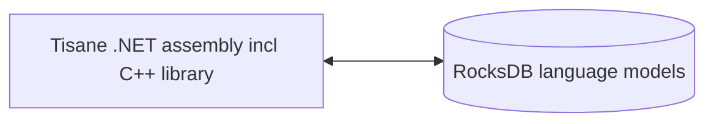

# Tisaneエンベデッド.NETリファレンス

## 概要

Tisaneエンベデッドは、Tisaneの自然言語処理（NLP）機能をデスクトップおよびサーバー.NETアプリケーションに直接組み込むことができます。 

本ガイドは、.NETアプリケーション用のTisaneエンベデッドSDKで利用可能なメソッドのリファレンスを提供します。

### コンポーネント

内部で、TisaneランタイムがRocksDBストアに格納されたTisane言語モデルと直接通信します。クライアントサーバーデータベースエンジンをインストールする必要はありません。



#### バイナリ

- ランタイムライブラリ：
- 
  - `libTisane.dll`：Tisaneコアランタイムに組み込まれたRocksDBライブラリ。
  - `libgcc_s_seh-1.dll`：標準POSIX C/C++ライブラリ。
  - `libstdc++-6.dll`：標準POSIX C/C++ライブラリ。
  - `libwinpthread-1.dll`：標準POSIX C/C++ライブラリ。

- .NETラッパーファイル：
  - `Tisane.Runtime.dll` – コアライブラリをラップする.NETアセンブリ。  これは、.NETプロジェクトで参照する主要なアセンブリです。
  - `native/amd64/rocksdb.dll` – RocksDBのWindowsポート。
  - `RocksDbSharp.dll`：RocksDB用の.NETラッパー。
  - `netstandard.dll`：標準の.NETアセンブリ。
  - `Newtonsoft.Json.dll`：  JSONパーシングアセンブリ。
  - `System.*.dll`, `Microsoft.*.dll`：  その他の標準的な.NETアセンブリ。

#### 言語モデル

参考：[言語モデルデータストア](./languagemodels.md) 

### 必要事項

#### ランタイム

ASP.NET Core Runtime 8+

#### RAM

**遅延読み込み**：50 Mb固定 + 50～100 Mb（言語モデルあたり）

**完全読み込み**：400 Mbから2 Gbの間（言語モデルあたり）

続きを読む：[遅延読み込みと完全読み込みの比較](./lazyloading.md)

## デプロイメント

配布パッケージの内容を、お好みのディレクトリに抽出してください。 

データディレクトリの名前を含む`DbPath`設定が正しいことを確認してください。 



Tisane .NETアセンブリは、`ConfigurationManager`設定（XML）を使用します。設定ファイルの名前：`executable filename without extension` + `.dll.config`。

例えば、実行ファイルが`Tisane.TestConsole.Desktop.exe`である場合、設定ファイルは`Tisane.TestConsole.Desktop.dll.config`です。



#### コアメソッド

##### Parse

```c#
string Parse(string language, string content, string settings)
```

テキストを解析し、結果をJSON構造として返します。

- `language`：解析用の言語コード。`*`またはパイプ区切りの言語コードのリスト（例：`de|fr|ja`）を使用して言語を自動検出します。
- `content`：解析対象のテキスト。
- `settings`：解析設定を定義するJSONオブジェクト。参考：[設定およびカスタマイズガイド](../apis/tisane-api-configuration.md)。

リターン：JSON形式のレスポンスオブジェクト。

例：

```c#
string result = Tisane.Server.Parse("en", "What a lovely day", "{}");
Console.WriteLine(result);
```

こちらも参考： 
 
* [レスポンスガイド](../apis/tisane-api-response-guide.md)

##### Transform

```c#
string Transform(string sourceLanguage, string targetLanguage, string content, string settings)
```

テキストを翻訳または置き換えます。

- `sourceLanguage`：  入力テキストの言語コード。`*`またはパイプ区切りのリスト（例：`de|fr|ja`）を使用して言語を自動検出します。
- `targetLanguage`：ターゲット言語コード
- `content`：変換対象のテキスト
- `settings`：変換設定で定義されたJSONオブジェクト。参考：[設定およびカスタマイズガイド](../apis/tisane-api-configuration.md)。

リターン：変換／翻訳されたテキスト。

こちらも参照： 

- [APIレスポンスおよびコンフィギュレーションガイド](../apis/tisane-api-response-guide.md)

例：

```c#
string result = Tisane.Server.Transform("fr", "en", "Bonjour!", "{}");
Console.WriteLine(result);
```

##### DetectLanguage

```c#
string DetectLanguage(string content, string likelyLanguages, string delimiter)
```

テキスト内の言語を識別します。

- `content`：解析対象のテキスト
- `likelyLanguages`：パイプ区切りの言語コードに適したリスト（例：de|fr|ja)。言語が不明な場合は、*、?、または空の文字列を使用してください。
- `delimiter`：テキストのチャンク化用のオプションのカスタム区切り文字（正規表現、Google RE2形式）。例：  文、段落。省略した場合、全体の内容が一つのチャンクとして解析されます。

例：

```c#
string text = "This is English.  C'est français.";
string likelyLanguages = "en|fr";
string delimiter = @"\. "; // Split on sentences
string result = Tisane.Server.DetectLanguage(text, likelyLanguages, delimiter);
Console.WriteLine(result);
```

#### 言語モデルへのアクセス方法

これらのメソッドにより、言語モデルの内容をクエリ・検査できます。

##### GetFamilyData

```c#
string GetFamilyData(int id)
```

語族の説明と属性を持つJSONドキュメントを返します。

- `id`：取得対象の語族のID。

##### ListSenses

```c#
string ListSenses(string language, string word)
```

単語に紐付けられた語族を、ID、説明、特徴と共に一覧表示します。JSONドキュメント（Stream）を返します。

- `language`：言語コード。自動言語検出はサポートされていません。**
- `word`：検索対象の単語（または複数単語から成る表現）。活用形であり、必ずしも見出語ではありません。

##### ListHypernyms

```c#
string ListHypernyms(int family, int maxLevel)
```

既定の語族に対して、その上位語（より広範な用語）を含むJSONドキュメントを返します。

- `family`：上位語を一覧表示する語族のID。
- `maxLevel`：上位語階層において、上方向に移動する階層の最大数。

##### GetInflectedForms

```c#
string GetInflectedForms(string language, int lexeme, int family)
```

見出語と語族に紐付けられた活用形（単語の派生形）を含むJSONオブジェクトを返します。

- `language`：言語コード。自動言語検出はサポートされていません。**
- `lexeme`：見出語のID。
- `family`：語族のID。

#### Cleanupメソッド

これらのメソッドは、パース対象のテキストを抽出または整理するためのヘルパーメソッドです。

##### Normalize

```c#
string Normalize(string dirtyText)
```

OCRのアーチファクト、メールのヘッダー／署名、その他の定型文の断片を削除して、クリーンなテキストを返します。

- `dirtyText`：クリーンアップ対象のテキスト。

##### ExtractText

```c#
string ExtractText(string webpageText)
```

ウェブページからHTMLマークアップを削除し、平文のテキストコンテンツを抽出します。

- `webpageText`：ウェブページのHTMLコンテンツ。

Return：抽出されたテキスト。