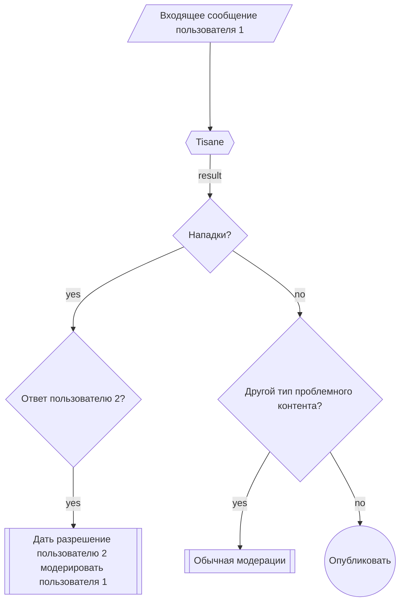

# О двухфакторной модерации

Двухфакторная модерация — это способ модерации, используемый в чатах в режиме реального времени, например, общение внутри игр. Двухфакторная модерация походит на двухфакторную аутентификацию (2FA), требуя два независимых ввода, чтобы вынести решение.

## Зачем она нужна?
- Общение в чатах в реальном времени часто становится токсичным и отпугивает пользователей.
- Нанимать специальных модераторов-людей для контроля чатов в реальном времени — дорогое и зачастую непрактичное занятие.
- Модерирование чата вручную — непопулярная и морально утомительная задача для модераторов.
- С другой стороны, автоматическая модерация может давать ложные срабатывания.

Обратите внимание, что двухфакторная модерация работает только в тех случаях, когда объектом становится другой пользователь, например, личные нападки (оскорбления, кибербуллинг).

## Как работает двухфакторная модерация
1. Tisane помечает сообщение как содержащее личные нападки на другого пользователя.
2. Пользователю, на которого направлено действие, предоставляются временные привилегии модератора для одобрения санкций в отношении нарушителя (например, отключение возможности высказываться или бан).
3. Если обнаружение Tisane дало сбой и сообщение на самом деле не является оскорблением, целевой пользователь, скорее всего, решит не принимать ответных мер. Если это действительно оскорбление, виновный в нападках будет наказан.

Поскольку более 90% оскорблений являются личными нападками, такой подход значительно снижает нагрузку на модераторов. Эта система также действует как сдерживающий фактор. Тролли менее склонны нападать на других, когда знают, что жертва может немедленно применить санкции в ответ.

Для контента, который не является личной нападкой, применяется стандартная процедура модерации. 

## Прцесс двухфакторной модерации

## Возможные сценарии и результаты

#### Сценарий 1. Успешная модерация

1. Пользователь 1 оскорбляет Пользователя 2.

2. Tisane расценивает это как личную напалку.
3. Пользователю 2 предоставляются временные права модератора, и он блокирует Пользователя 1.

#### Сценарий 2. Обработка ложных срабатываний

1. Пользователь 1 публикует комментарий, который ошибочно помечен как оскорбительный.

2. Пользователю 2 предоставлены права модератора, но он решает не предпринимать никаких действий, поскольку реальной нападки не было.

#### Сценарий 3. Разжигание ненависти или другие нарушения

1. Пользователь 1 публикует нетерпимый или иным образом оскорбительный контент, обращенный к широкому кругу лиц.

2. Tisane классифицирует это как нетерпимость.
3. Применяются стандартные процессы модерации, такие как отправка контента модераторам.

## Преимущества двухфакторной модерации

- Снижает зависимость от модераторов-людей, сохраняя при этом эффективность контроля.
- Поощряет самоконтроль, предотвращая нападения троллей на других пользователей.
- Минимизирует количество ложных срабатываний, поскольку в конечном итоге решение о совершении действия принимает целевой пользователь.

