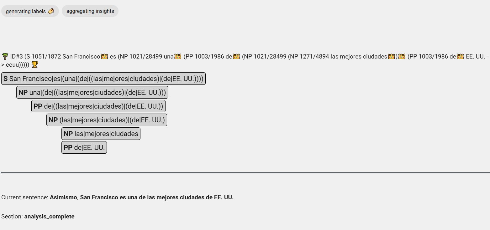

# Объясняемость и прозрачность

Как в сфере доверия и безопасности, так и в сфере обеспечения правопорядка первостепенное значение имеет возможность отслеживать ход действий системы при принятии решения. Сегодня алгоритмическая прозрачность также необходима согласно [Закону ЕС о цифровых услугах](https://digital-strategy.ec.europa.eu/en/policies/dsa-brings-transparency) . 

## Предоставление понятных человеку объяснений

Если в качестве настройки указан параметр `"explain":true`, то для каждого элемента `abuse` и ` sentiment_expression` предоставляется человекопонятное объяснение.

### Пример

Запрос:
```json
{
  "content":"u r a liar",
  "language":"en",
  "settings":{"snippets":true, =="explain":true==}
}
```

Ответ:
```json
{
	"text": "u r a liar",
	"topics": [
		"dishonesty"
	],
	"abuse": [
		{
			"sentence_index": 0,
			"offset": 0,
			"length": 10,
			"text": "u r a liar",
			"type": "personal_attack",
			"severity": "high",
			"explanation": "Claim that discussion participant is unwelcome person"
		}
	],
	"sentiment_expressions": [
		{
			"sentence_index": 0,
			"offset": 0,
			"length": 10,
			"text": "u r a liar",
			"polarity": "negative",
			"explanation": "Unfavourable opinion",
			"targets": [
				"credibility"
			]
		}
	]
}
```

## Отслеживание и отладка решений платформы

В режиме отладки Tisane генерирует журнал, который затем можно загрузить в специальную среду отладчика.




Платформа Портала языковых моделей доступна только для установок в частном облаке.

[Contact us](https://tisane.ai/contact-us/) for more info.