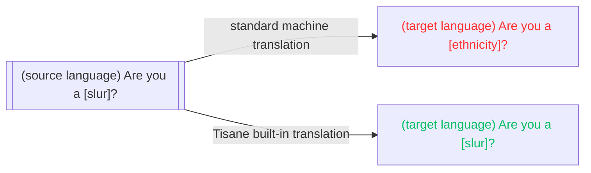

# Встроенный перевод

Tisane предоставляет возможность машинного перевода, в первую очередь для пояснительных целей. При переводе используются те же языковые модели, что и для аналитических целей, что гарантирует единообразие результатов. 

Чтобы использовать перевод, вызовите `POST /transform`. Ответ представляет собой простой текст (перевод исходного высказывания).

Рекомендуем ознакомиться: [Перевод текста](/apis/tisane-api-short/nlu-nlp-methods/transform).

## Стандартный машинный перевод по сравнению с машинным переводом Tisane

Стандартные системы машинного перевода (Google Translate, Microsoft Translator, DeepL) в основном используются для перевода контента с целью его публикации. Современные поисковые системы, хотя и способны обрабатывать разнообразный контент, обучены лишь распознавать небольшое количество непристойностей и оскорблений. В коммерческих целях они в основном используются для перевода технических, научных текстов, официальных заявлений или новостей.

Во избежание скандалов и судебных исков оскорбления и непристойности не рассматриваются в первую очередь и по возможности удаляются. Часто к просьбам добавляют слово «пожалуйста», даже если его нет в оригинале.

Это означает, что **эмоциональная составляющая не сохраняется** . Если, скажем, исходный текст содержал оскорбление, то стандартный машинный перевод, скорее всего, не будет его содержать. Модераторам глобальных сообществ, использующим стандартный машинный перевод, будет сложно понять реакцию людей, если стиль будет изменен. (Сравните: «Ты [этническая принадлежность]?» по сравнению с «Ты [оскорбление]?»)

Другая проблема заключается в том, что стандартный машинный перевод плохо справляется со сложными словами. 

Вот почему мы создали машинный перевод, адаптированный для модерации контента и нужд правоохранительных органов:

* Машинный перевод Tisane сохраняет исходную эмоциональную составляющую: оскорбления и ненормативная лексика на исходном языке переводятся как оскорбления и ненормативная лексика на целевом языке.
* Машинный перевод Tisane может расшифровать алгоязык, поскольку он использует тот же процесс анализа.



## Пример

Запрос:

```json
{
  "from": "fr",
  "to": "en",
  "content": "tu es une taspe",
  "settings": {}
}
```

Ответ:
```text
you are a bitch
```