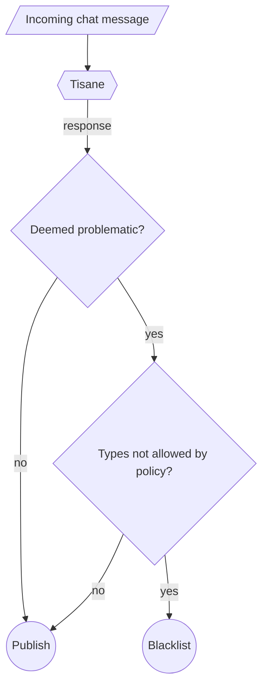

# Модерирование чата в реальном времени

Tisane широко используется для модерирования живого общения между пользователями на платформах группового обмена мгновенными сообщениями. Обычно в чатах Tisane работает в полностью автоматическом режиме. 

Если ложные срабатывания представляют собой деликатный вопрос, можно установить процедуру апелляции и человеческого контроля (по запросу).

## Стандартная интеграционная архитектура

Как показано на схеме ниже: простая архитектура интеграции сканирует каждое сообщение и помещает его в черный список или отправляет на специальный канал, если оно считается проблемным и политики не допускают `abuse` такого типа, который был обнаружен.

1. Клиентское приложение отправляет сообщения в Tisane для сканирования.
2. Tisane помечает сообщения в зависимости от уровня серьезности и типа оскорбления.
3. Затем клиентское приложение должно проверить, запрещены ли типы записей, зарегистрированных в разделе `abuse`, политикой сообщества.
4. Если есть запрещенные типы, пост заносится в черный список. (Предположительно, сообщение отправлено на специальный канал для модераторов. В целях технического обслуживания не рекомендуется удалять сообщения без следа).
5. Если нет запрещенных типов или в ответе Tisane нет раздела `abuse`, пост публикуется.

## Интеграции с открытым исходным кодом

Наш партнер PubNub создал демоверсию модерации контента, беспроблемно интегрированную с Tisane, и опубликовал ее исходный код на GitHub. Реализация позволяет пользователям динамически устанавливать политику модерации сообщества. 

- [Панель управления модерацией PubNub для чата](https://www.pubnub.com/demos/moderation-dashboard/)
- [pubnub/moderation-dashboard on GitHub](https://github.com/pubnub/moderation-dashboard)

## Интеграции с популярными платформами

Рекомендуем ознакомиться: [Интеграции — Tisane Labs](https://tisane.ai/integrations)

