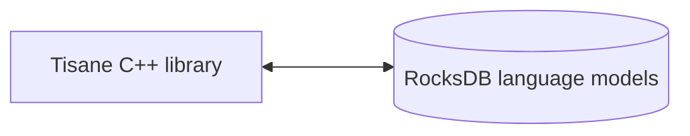

# Справка Tisane Embedded C/C++

## Обзор

В этом руководстве содержится ссылка на функции, доступные в Tisane Embedded SDK для приложений C/C++. 

### Компоненты

Внутри себя среда выполнения Tisane напрямую взаимодействует с языковыми моделями Tisane, хранящимися в хранилищах RocksDB. Никакие внешние механизмы баз данных не используются и не требуют установки.



#### Двоичные файлы

##### Windows

- Библиотеки исполняющей системы:
- 
  - `libTisane.dll`: Основная среда выполнения Tisane.
  - `libgcc_s_seh-1.dll`: Стандартная библиотека POSIX C/C++.
  - `libstdc++-6.dll`: Стандартная библиотека POSIX C/C++.
  - `libwinpthread-1.dll`: Стандартная библиотека POSIX C/C++.

##### Linux

- tisane: Основной исполняемый файл Tisane.

#### Языковые модели

Рекомендуем ознакомиться: [Хранилища данных языковых моделей](./languagemodels.md) 

## Требования

### Платформа

#### Windows
Windows 10+ (64-битная)



Более ранние версии Windows могут работать, но официально не поддерживаются. 



#### Linux

Версия ядра 6.0.0+

### ОЗУ

**Ленивая загрузка** : 50 МБ фиксированной квоты + 50–100 МБ на языковую модель

**Полностью загружено** : от 400 МБ до 2 ГБ на языковую модель

Подробнее: [Сравнение режима ленивой загрузки с режимом полной загрузки](./lazyloading.md)

## Интеграция

### Базовый рабочий процесс

1. `SetDbPath` – установить путь к данным.
2. `LoadAnalysisLanguageModel` – загрузить нужную языковую модель.
3. `Parse` – проанализировать текст.

### Настройка и использование

1. Включите заголовочный файл:  
  *  Убедитесь, что вы включили необходимый заголовочный файл ([`tisane.h`](./tisane.h)) в вашем проекте C/C++. 
  *  Этот файл будет содержать заявления функций.

2. Свяжите свое приложение с библиотекой Tisane (например, `tisane.so` или `libTisane.dll`).  

3. Инициализируйте:

  * Установите путь к данным: 

      *   *Самый первый* вызов, который вам *нужно * сделать, — это` SetDbPath`.  
      *   Он сообщает SDK, где найти файлы данных языковой модели.

  *   Загрузите языковую модель:  
      *   Вызовите `LoadAnalysisLanguageModel` для загрузки желаемой языковой модели.  
      *   Вызовите *после* `SetDbPath`
      *   Загрузка всей языковой модели может занять некоторое время, особенно в случае с большими моделями.
  *   Если вы планируете преобразовать (например, перевести), загрузите модель языка генерации:
      *   Вызовите `LoadGenerationLanguageModel` для загрузки желаемой языковой модели для целевого языка. 
4.   Процесс:
  *   Выполните парсинг текста: 
    *   Используйте функцию `Parse` для анализа текста с использованием заданных настроек: 
        *   `language`: Стандартный код языка ISO-639-1 (например, `en`, `zh-CN`), список кодов языков, разделенных вертикальной чертой, или`*` для автоматического обнаружения.
        *   `content`: Текст UTF-8 для парсинга.
        *   `settings`: Строка JSON с настройками. (Рекомендуем ознакомиться: [Руководство по реагированию и настройке](../apis/tisane-api-response-guide.md)).`
        *   `Returns`: строка JSON (Рекомендуем ознакомиться: [Руководство по реагированию и настройке](../apis/tisane-api-response-guide.md)).
    
  *   Определите язык: 
    *   Используйте функцию `DetectLanguage` для определения языка данного текста.
        *   `content`: текст в кодировке UTF-8.
        *   `likelyLanguages`: (необязательно) ожидаемые языки.
        *   `segmentDelimiter`: (необязательно) разделяет разделы текста для определения языка. Хотя различные языки могут быть обнаружены без явно указанного разделителя, разделитель обеспечивает больший контроль над результатами.
        *   `Returns`: коды обнаруженного языка.
    
  *   Преобразуйте текст:  
    *   Используйте функцию `Transform` для перевода или перефразирования строки с одного языка на другой. 
        *   `sourceLanguage`: Стандартный код языка ISO-639-1 (например, `en`, `zh-CN`), список кодов языков, разделенных вертикальной чертой, или`*` для автоматического обнаружения.
        *   `targetLanguage`: код языка, на который необходимо выполнить перевод, или список кодов языков, разделенных вертикальной чертой.
        *   `content`: текст в кодировке UTF-8 для преобразования.
        *   `settings`: строка JSON.
        *   `Returns`: преобразованный текст, если указан один целевой язык; массив JSON, содержащий переводы, если указано несколько языков.


Смотрите также: 

- [Руководство по настройке и ответу API](../apis/tisane-api-response-guide.md)


## Ссылка на функции

### SetDbPath

```cpp
__stdcall void SetDbPath(const char *dataRootPath);
```

Определяет корневой путь к файлам данных языковой модели. Эту функцию необходимо вызвать до использования любых других функций Tisane SDK.

* `dataRootPath`: Строка в стиле C с нулевым завершением, представляющая абсолютный или относительный путь к каталогу, содержащему данные языковой модели.

Возвращаемое значение: 

Нет.

Например:

```cpp
SetDbPath("C:\\Tisane");
```
### LoadAnalysisLanguageModel

```cpp
__stdcall void LoadAnalysisLanguageModel(const char *languageCode);
```

Загружает языковую модель для использования функции `Parse` или как исходный язык в функции `Transform`.

Параметры:

* `languageCode`: Строка в стиле C с нулевым завершением, представляющая код языка. Например: `"en"` для английского, `"es"` для испанского.

Возвращаемое значение: 

Нет.

Например:

```cpp
LoadAnalysisLanguageModel("en");
```
### LoadGenerationLanguageModel
```cpp
__stdcall void LoadGenerationLanguageModel(const char *languageCode);
```

Загружает языковую модель, которая будет использоваться в качестве модели целевого языка для задач генерации текста, таких как перевод и перефразирование.



Модели генерации всегда загружаются в ленивом режиме.



Параметры:

* `languageCode`: Строка в стиле C с нулевым завершением, представляющая код языка.

Возвращаемое значение: 

Нет.

Например:

```cpp
LoadGenerationLanguageModel("fr"); // Load French for translation
```

### LoadCustomizedAnalysisLanguageModel
```cpp
__stdcall void LoadCustomizedAnalysisLanguageModel(const char *languageCode, const char *customizationSuffix);
```

Загружает настроенную языковую модель. Это позволяет расширить базовую языковую модель с помощью предметно-специфического словаря или логики. Пользовательская языковая модель запускается вместе с основной языковой моделью и имеет приоритет над определениями основной модели.

Параметры:

* `languageCode`: Код языка базовой языковой модели.

- `customizationSuffix`: Суффикс, идентифицирующий конкретную модель надстройки. SDK будет искать папку с указанным именем в текущей корневой папке.

Возвращаемое значение: 

Нет.

Например:

```cpp
SetDbPath("C:\\Tisane");
LoadCustomizedAnalysisLanguageModel("en", "medical"); // Load a customized English model for the medical domain
// Tisane will look for additional language models under C:\\Tisane\\medical\\
```

### UnloadAnalysisLanguageModel
```cpp
__stdcall void UnloadAnalysisLanguageModel(const char *languageCode);
```

Выгружает из памяти ранее загруженную модель языка анализа. 

Параметры:

* `languageCode`: Код языка выгружаемой модели.

Возвращаемое значение: 

Нет.

Например:

```cpp
UnloadAnalysisLanguageModel("en");
```

### SetProgressCallback
```cpp
void SetProgressCallback(void __stdcall ptrProgressCallback(double));
```

Устанавливает функцию обратного вызова для получения обновлений хода выполнения во время загрузки языковой модели. Это полезно для предоставления визуальной обратной связи пользователю во время процесса загрузки, который может занять значительное время.

Параметры:

* `ptrProgressCallback`: Указатель на функцию, которая принимает один двойной параметр. Двойное значение будет находиться в диапазоне от 0,0 до 1,0, представляя ход загрузки (0,0 = 0%, 1,0 = 100%).

Возвращаемое значение: 

Нет.

Например:

```cpp
#include <iostream>

void __stdcall MyProgressCallback(double progress) {
    std::cout << "Loading progress: " << (progress * 100) << "%" << std::endl;
}

int main() {
    SetProgressCallback(MyProgressCallback);
    // ... load language model ...
    return 0;
}
```

### SetParseProgressCallback
```cpp
void SetParseProgressCallback(bool __stdcall ptrParseProgressCallback(double));
;
```

Устанавливает функцию обратного вызова для получения уведомлений о прогрессе во время обработки. Это полезно для предоставления визуальной обратной связи пользователю во время длительного анализа и позволяет пользователю отменить обработку.

При отмене обработки возвращаются частичные результаты с дополнительным 
`interrupted` attribute set to `true` in the response JSON.

Параметры:

* `ptrParseProgressCallback`: Указатель на функцию, которая принимает один двойной параметр и возвращает логическое значение. Двойное значение будет находиться в диапазоне от 0,0 до 1,0, представляя ход загрузки (0,0 = 0%, 1,0 = 100%). Логическое значение указывает, следует ли прерывать цикл обработки. При выходе Tisane суммирует все предложения на данный момент и возвращает свой обычный ответ.

Возвращаемое значение: 

Нет.

Например:

```cpp
#include <iostream>

bool MyParseProgressCallback(double progress) {
    std::cout << "Progress: " << progress << "%. Abort? Y/N" << std::endl;
    char answer;
    std::cin.get(answer);
    return std::toupper(answer) == 'Y';
}


int main() {
    SetDbPath("C:\\Tisane");
    ActivateLazyLoading(); // не нужно загружать всю модель для теста
    LoadAnalysisLanguageModel("en");
    SetParseProgressCallback(MyParseProgressCallback);
    cout << "\n" << Parse("en", "This is a test. This is a test. This is a test. This is a test. ", "{\"parses\":true, \"words\":true}" << std::endl);   
    return 0;
}
```
### ActivateLazyLoading

```cpp
void ActivateLazyLoading();
```
Активирует режим отложенной загрузки.

Режим чтения: [Сравнение режима ленивой загрузки с режимом полной загрузки](./lazyloading.md)


Параметры: 

Нет.

Возвращаемое значение: 

Нет.

Например:

```cpp
ActivateLazyLoading();
```

### IsLazyLoadingActive
```cpp
bool IsLazyLoadingActive();
```

Проверяет, активен ли в данный момент режим ленивой загрузки.

Параметры: 

Нет.

Возвращаемое значение:

- `true`, если ленивая загрузка активна, 
- `false` в противном случае.

Например:

```cpp
if (IsLazyLoadingActive()) {
    std::cout << "Lazy loading is active." << std::endl;
}
```

### Parse
```cpp
const char* Parse(const char *language, const char *content, const char *settings);
```

Выполняет синтаксический анализ заданного текстового содержимого, используя указанную языковую модель и настройки.

Параметры:

* `language`: Код языка, который необходимо проанализировать.
* `content`: Текст для анализа (в кодировке UTF-8).
* `settings`: Строка JSON, определяющая желаемые функции анализа. Подробную информацию см. в разделе [Конфигурация и настройка](../apis/tisane-api-configuration).

Возвращаемое значение:  

`const char*` со строкой JSON, представляющей результаты анализа. Нет необходимости освобождать память. При неудаче возвращает `nullptr`.


Пример кода:

```cpp
  SetDbPath("C:\\Tisane");
  ActivateLazyLoading(); // не нужно загружать всю модель для теста
  LoadAnalysisLanguageModel("en");
  cout << "\n" << Parse("en", "This is a test.", "{\"parses\":true, \"words\":true}");
```


Рекомендуем ознакомиться: [Ответ](../apis/tisane-api-response-guide.md) .

### ParseTextFile
```cpp
const char* ParseTextFile(const char *language, const char *filename, uint32_t chunkSize, const char *settings);
```

Выполнить синтаксический анализ содержимого указанного текстового файла на указанном языке с использованием указанных настроек по фрагментам. Загружает только обрабатываемый фрагмент.

Параметры:

* `language`: код языка, который необходимо проанализировать.
* `filename`: текстовый файл для анализа (в кодировке UTF-8). Предполагается, что содержит только текст.
* `chunkSize`: Размер фрагментов, используемых для чтения потока из файла. Если 0, то выделяется 8192 байта.
* `settings`: Строка JSON, определяющая желаемые функции анализа. Подробную информацию см. в разделе [Конфигурация и настройка
](../apis/tisane-api-configuration).

Возвращаемое значение:  

`const char*` со строкой JSON, представляющей результаты анализа. Нет необходимости освобождать память. При неудаче возвращает `nullptr`.



Для больших файлов текст в ответе опускается в целях повышения производительности.



Пример кода:

```cpp
  SetDbPath("C:\\Tisane");
  ActivateLazyLoading(); // не нужно загружать всю модель для теста
  LoadAnalysisLanguageModel("en");
  std::string result = ParseTextFile("en", "myinputfile.txt", 8192, "{}");
```

### DetectLanguage

```cpp
__stdcall const char* DetectLanguage(const char *content, const char *likelyLanguages, const char* segmentDelimiter);
```
Определяет язык указанного текстового содержимого.

Параметры:

* `content`: Текст для анализа (в кодировке UTF-8).
* `likelyLanguages`: (Необязательно) Список кодов языков, разделенных запятыми, которые, вероятно, будут присутствовать в тексте. Это может повысить точность обнаружения. Передайте nullptr, если не требуется.
* `segmentDelimiter`: (Необязательно) Строка, используемая для разделения сегментов в тексте. Для каждого сегмента обнаружение будет вызываться отдельно. Передайте nullptr для поведения по умолчанию.

Возвращаемое значение: 

`const char*` со строкой JSON, представляющей обнаруженный язык(и). При неудаче возвращает `nullptr`.



Не освобождайте память. Управление ею осуществляется изнутри.



Например:
```cpp
const char* detectedLanguage = DetectLanguage("Bonjour le monde!", nullptr, nullptr);
if (detectedLanguage) {
    std::cout << "Detected Language: " << detectedLanguage << std::endl;
    // free memory
}
```

### Transform
```cpp
__stdcall const char* Transform(const char * sourceLanguage, const char * targetLanguage,const char * content, const char * settings);
```
Переводит или перефразирует строку с одного языка на другой. 

Требуется, чтобы модели исходного и целевого языков были загружены с использованием ` LoadGenerationLanguageModel` .

Параметры:

* `sourceLanguage`: код исходного языка.
* `targetLanguage`: код языка перевода.
* `content`: текст для преобразования (в кодировке UTF-8).
* `settings`: строка JSON, указывающая желаемые параметры преобразования. 

Смотрите также: 

- [Руководство по ответу API](../apis/tisane-api-response-guide.md)
- [Конфигурация и настройка](../apis/tisane-api-configuration.md)

Возвращаемое значение: 

`const char*`, содержащий переведенный или перефразированный текст. Нет необходимости освобождать память. При неудаче возвращает `nullptr`.

Например:
```cpp
  SetDbPath("C:\\Tisane");
  ActivateLazyLoading(); // не нужно загружать всю модель для теста
  LoadAnalysisLanguageModel("fr");
  LoadGenerationLanguageModel("en");
  const char* translatedText = Transform("fr", "en", "bonjour!", "{}");
  if (translatedText) {
    std::cout << "Translated Text: " << translatedText << std::endl;
    // free memory
  }
```
