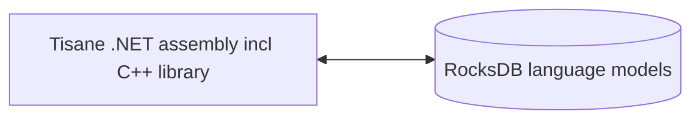

# Справка по Tisane Embedded для .NET

## Обзор

Tisane Embedded позволяет интегрировать возможности обработки естественного языка (NLP) Tisane непосредственно в ваши .NET-приложения для ПК и серверов. 

В этом руководстве содержится ссылка на методы, доступные в Tisane Embedded SDK для приложений .NET.

### Компоненты

Внутри себя среда выполнения Tisane напрямую взаимодействует с языковыми моделями Tisane, сохраненными в хранилищах RocksDB. Установка клиент-серверных баз данных не требуется.



#### Двоичные файлы

- Библиотеки исполняющей системы:
- 
  - `libTisane.dll`: Основная среда выполнения Tisane со встроенной библиотекой RocksDB.
  - `libgcc_s_seh-1.dll`: Стандартная библиотека POSIX C/C++.
  - `libstdc++-6.dll`: Стандартная библиотека POSIX C/C++.
  - `libwinpthread-1.dll`: Стандартная библиотека POSIX C/C++.

- Файлы-оболочки .NET:
  - `Tisane.Runtime.dll` — сборка .NET, которая оборачивает основную библиотеку.  Это основная сборка, на которую вы будете ссылаться в своем проекте .NET.
  - `native/amd64/rocksdb.dll` – порт RocksDB для Windows.
  - `RocksDbSharp.dll`: оболочки .NET для RocksDB.
  - `netstandard.dll`: стандартная сборка .NET.
  - `Newtonsoft.Json.dll`:  сборка для парсинга JSON.
  - `System.*.dll`, `Microsoft.*.dll`:  другие стандартные сборки .NET.

#### Языковые модели

Рекомендуем ознакомиться: [Хранилища данных языковых моделей](./languagemodels.md) 

### Требования

#### Время выполнения

Среда выполнения ASP.NET Core 8+

#### ОЗУ

**Замедленная загрузка**: 50 МБ фиксированной квоты + 50–100 МБ на языковую модель

**Полная загрузка** : от 400 МБ до 2 ГБ на языковую модель

Подробнее: [Сравнение режима замедленной загрузки с режимом полной загрузки](./lazyloading.md)

## Развертывание

Извлеките содержимое пакета дистрибутива в каталог по вашему выбору. 

Убедитесь, что верна настройка `DbPath` , содержащая имя каталога данных. 



Сборки Tisane .NET используют конфигурации `ConfigurationManager` (XML). Имя файла конфигурации: `имя исполняемого файла без расширения` + `.dll.config` .

Например, если ваш исполняемый файл `Tisane.TestConsole.Desktop.exe`, то конфигурация будет `Tisane.TestConsole.Desktop.dll.config`.



#### Основные методы

##### Parse

```c#
string Parse(string language, string content, string settings)
```

Анализирует текст и возвращает структуру JSON с результатами.

- `language`: код языка для анализа. Используйте `*` для автоматического определения языка или список кодов языков, разделенных вертикальной чертой (например, `de|fr|ja`).
- `content`: Текст для анализа.
- `settings`: объект JSON, определяющий настройки анализа. Ознакомьтесь с [Руководством по настройке и кастомизации](../apis/tisane-api-configuration.md).

Возвращает: объект ответа JSON.

Например:

```c#
string result = Tisane.Server.Parse("en", "What a lovely day", "{}");
Console.WriteLine(result);
```

См. также: 
 
* [Руководство по ответам](../apis/tisane-api-response-guide.md)

##### Transform

```c#
string Transform(string sourceLanguage, string targetLanguage, string content, string settings)
```

Переводит или перефразирует текст.

- `sourceLanguage`:  код языка входного текста. Используйте `*` или список, разделенный вертикальной чертой (например,` de|fr|ja`) для автоматического определения языка.
- `targetLanguage`: Код целевого языка
- `content`: текст для преобразования
- `settings`: объект JSON, определяющий параметры преобразования. Ознакомьтесь с [Руководством по настройке и кастомизации](../apis/tisane-api-configuration.md).

Возвращает: преобразованный/переведенный текст.

См. также: 

- [Руководство по ответам и настройке API](../apis/tisane-api-response-guide.md)

Например:

```c#
string result = Tisane.Server.Transform("fr", "en", "Bonjour!", "{}");
Console.WriteLine(result);
```

##### DetectLanguage

```c#
string DetectLanguage(string content, string likelyLanguages, string delimiter)
```

Определяет языки в тексте.

- `content`: текст для анализа
- `likelyLanguages`: Список вероятных языковых кодов, разделенных вертикальной чертой (например, de|fr|ja). Используйте *, ? или пустую строку, если языки неизвестны).
- `delimiter`: опциональный пользовательский разделитель (регулярное выражение, вариант Google RE2) для разбиения текста на части. Например:  предложение, абзац. Если этот параметр пропущен, весь контент анализируется как единый фрагмент.

Например:

```c#
string text = "This is English.  C'est français.";
string likelyLanguages = "en|fr";
string delimiter = @"\. "; // Split on sentences
string result = Tisane.Server.DetectLanguage(text, likelyLanguages, delimiter);
Console.WriteLine(result);
```

#### Методы доступа к языковой модели

Эти методы позволяют запрашивать и проверять содержимое языковых моделей.

##### GetFamilyData

```c#
string GetFamilyData(int id)
```

возвращает документ JSON с описанием семейства и атрибутами.

- `id`: идентификатор семейства, которое необходимо получить.

##### ListSenses

```c#
string ListSenses(string language, string word)
```

Перечисляет семейства, связанные со словом, с идентификаторами, описаниями и характеристиками. Возвращает документ JSON (поток).

- `language`: код языка. *Автоматическое определение языка не поддерживается.*
- `word` : слово (или многословное выражение), которое нужно найти. Может быть склоняемой формой, не обязательно леммой.

##### ListHypernyms

```c#
string ListHypernyms(int family, int maxLevel)
```

Возвращает документ JSON, содержащий гипернимы (более широкие термины) для заданного семейства.

- `family`: Идентификатор семейства, для которого необходимо составить список гипернимов.
- `maxLevel`: максимальное количество уровней, на которые можно подняться вверх в иерархии гипернимов.

##### GetInflectedForms

```c#
string GetInflectedForms(string language, int lexeme, int family)
```

возвращает объект JSON, содержащий флективные формы (варианты слова), связанные с лексемой и семейством.

- `language`: код языка. *Автоматическое определение языка не поддерживается.*
- `lexeme`: идентификатор лексемы.
- `family`: идентификатор семейства.

#### Способы очистки

Это вспомогательные методы для извлечения или очистки текста для анализа.

##### Normalize

```c#
string Normalize(string dirtyText)
```

Возвращает очищенный текст, удаляя артефакты оптического распознавания, заголовки/подписи электронных писем и другие шаблонные фрагменты.

- `dirtyText`: текст для очистки.

##### ExtractText

```c#
string ExtractText(string webpageText)
```

Извлекает простой текстовый контент с веб-страницы, удаляя HTML-разметку.

- `webpageText`: HTML-содержимое веб-страницы.

Возвращает: извлеченный текст.