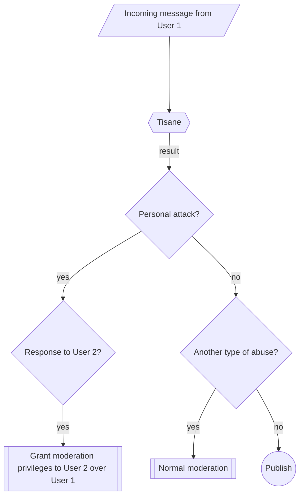

# Về Kiểm duyệt 2 yếu tố

2-Factor Moderation is a crowdsourced moderation approach designed for high-traffic, real-time chats, such as in-game communication. It works similarly to [2-Factor Authentication](https://en.wikipedia.org/wiki/Multi-factor_authentication), (2FA) by requiring two independent inputs to make a moderation decision.

## Lý do quy trình này là cần thiết?
- Các cuộc trò chuyện thời gian thực thường trở nên độc hại, khiến người dùng tránh xa.
- Việc thuê người điều hành chuyên trách cho các cuộc trò chuyện thời gian thực rất tốn kém và thường không thực tế.
- Kiểm duyệt cuộc trò chuyện theo cách thủ công là một nhiệm vụ không được yêu thích cho lắm và gây mệt mỏi về mặt tinh thần cho người kiểm duyệt.
- Mặt khác, việc kiểm duyệt tự động có thể đưa ra kết quả báo động giả.

Lưu ý rằng kiểm duyệt 2 yếu tố chỉ có hiệu lực đối với các loại kiểm duyệt khi có người dùng khác bị nhắm mục tiêu, ví dụ: tấn công cá nhân (lăng mạ, bắt nạt trên mạng).

## Cách thức hoạt động của Kiểm duyệt 2 yếu tố
1. Tisane đánh dấu một tin nhắn có nội dung tấn công cá nhân nhắm vào người dùng khác.
2. Người dùng bị nhắm mục tiêu được cấp quyền kiểm duyệt tạm thời để phê duyệt hành động trừng phạt đối với người vi phạm (ví dụ: cấm trò chuyện hoặc cấm người dùng).
3. Nếu khả năng phát hiện của Tisane không chính xác và thông điệp thực tế không phải là lời lăng mạ, thì người dùng bị nhắm mục tiêu có thể sẽ chọn hủy. Nếu thực sự có sự xúc phạm, người dùng có hành vi tấn công sẽ bị trừng phạt.

Vì các cuộc tấn công cá nhân chiếm hơn 90% các vụ lạm dụng nên cách tiếp cận này giúp giảm đáng kể khối lượng công việc kiểm duyệt của con người. Hệ thống này cũng có tác dụng ngăn chặn. Những kẻ thích chọc phá sẽ ít có khả năng tấn công người khác khi chúng biết nạn nhân có thể trừng phạt chúng ngay lập tức.

Đối với nội dung không mang tính công kích cá nhân, quy trình kiểm duyệt tiêu chuẩn sẽ được áp dụng. 

## Quy trình kiểm duyệt 2 yếu tố

## Các tình huống và kết quả có thể xảy ra

#### Tình huống 1: Kiểm duyệt thành công

1. Người dùng 1 lăng mạ Người dùng 2.

2. Tisane đánh dấu đó là hành vi tấn công cá nhân.
3. Người dùng 2 được cấp quyền kiểm duyệt tạm thời và cấm Người dùng 1.

#### Tình huống 2: Xử lý báo động giả

1. Người dùng 1 đăng bình luận nhưng lại bị đánh dấu nhầm là lăng mạ.

2. Người dùng 2 được cấp quyền kiểm duyệt nhưng chọn không thực hiện hành động vì không có hành vi tấn công thực sự nào xảy ra.

#### Tình huống 3: Phát ngôn thù hận hoặc các loại vi phạm khác

1. Người dùng 1 đăng nội dung lăng mạ có tính cố chấp hoặc có nội dung nhắm vào phạm vi rộng.

2. Tisane phân loại hành động đó là cố chấp.
3. Áp dụng các quy trình kiểm duyệt tiêu chuẩn, chẳng hạn như gửi nội dung cho người kiểm duyệt.

## Lợi ích của Kiểm duyệt 2 yếu tố

- Giảm sự phụ thuộc vào người kiểm duyệt trong khi vẫn duy trì quy trình thực thi quy định hiệu quả.
- Khuyến khích tự kiểm soát, ngăn chặn những kẻ thích chọc phá tấn công người khác.
- Giảm thiểu các kết quả báo động giả vì người dùng bị nhắm mục tiêu cuối cùng sẽ quyết định có nên hành động hay không.

