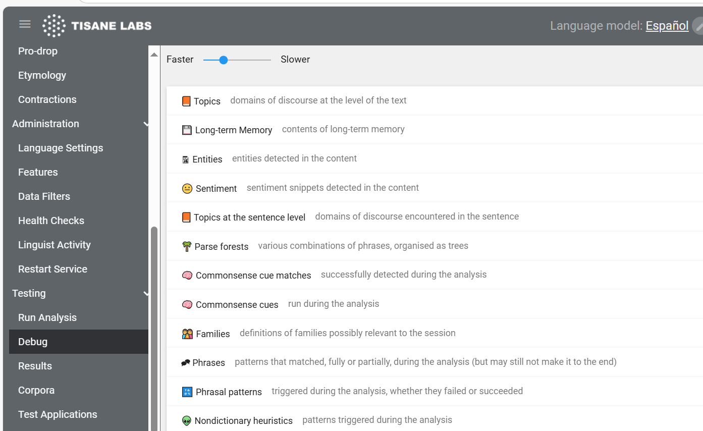

# Khả năng giải thích và tính minh bạch

Cả trong lĩnh vực tin cậy và an toàn lẫn thực thi pháp luật, khả năng truy vết lập luận của hệ thống khi đưa ra quyết định là điều tối quan trọng. Hiện nay, tính minh bạch trong thuật toán cũng là yêu cầu bắt buộc theo [Đạo luật Dịch vụ Kỹ thuật số của Liên minh châu Âu](https://digital-strategy.ec.europa.eu/en/policies/dsa-brings-transparency). 

## Cung cấp giải thích dễ hiểu cho con người

Nếu tùy chọn `"explain": true` được chỉ định, thì hệ thống sẽ cung cấp lời giải thích dễ hiểu cho con người đối với mỗi yếu tố liên quan đến hành vi `lạm dụng` và `biểu hiện_ cảm xúc`.

### Ví dụ

Yêu cầu:
```json
{
  "content":"u r a liar",
  "language":"en",
  "settings":{"snippets":true, =="explain":true==}
}
```

Phản hồi:
```json
{
	"text": "u r a liar",
	"topics": [
		"dishonesty"
	],
	"abuse": [
		{
			"sentence_index": 0,
			"offset": 0,
			"length": 10,
			"text": "u r a liar",
			"type": "personal_attack",
			"severity": "high",
			"explanation": "Claim that discussion participant is unwelcome person"
		}
	],
	"sentiment_expressions": [
		{
			"sentence_index": 0,
			"offset": 0,
			"length": 10,
			"text": "u r a liar",
			"polarity": "negative",
			"explanation": "Unfavourable opinion",
			"targets": [
				"credibility"
			]
		}
	]
}
```

## Truy vết và gỡ lỗi quyết định của nền tảng

Trong chế độ gỡ lỗi, Tisane sẽ tạo một nhật ký (log), nhật ký này có thể được tải vào một môi trường gỡ lỗi chuyên biệt.




Nền tảng Language Model Portal chỉ khả dụng cho các bản cài đặt đám mây riêng.

[Contact us](https://tisane.ai/contact-us/) for more info.