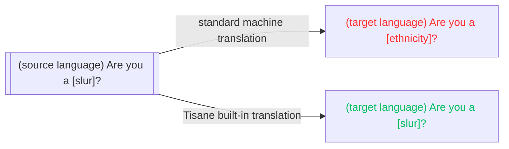

# Dịch tích hợp

Tisane cung cấp khả năng dịch máy, chủ yếu để giải thích. Việc dịch sử dụng cùng các mô hình ngôn ngữ như trong mục đích phân tích, giúp đảm bảo tính nhất quán trong kết quả. 

Để sử dụng chức năng dịch, gọi phương thức `POST /transform`. Cầu phản hồi sẽ là văn bản thuần (bản dịch của câu gốc).

Xem phần: [Dịch văn bản](/apis/tisane-api-short/nlu-nlp-methods/transform).

## So sánh giữa Dịch máy thông thường và Dịch máy của Tisane

Các công cụ dịch máy thông thường (như Google Translate, Microsoft Translator, DeepL) chủ yếu dùng để dịch nội dung nhằm mục đích xuất bản. Dù có khả năng xử lý nhiều loại nội dung khác nhau, các công cụ hiện đại này chỉ được huấn luyện với một lượng rất ít các từ tục tĩu hoặc xúc phạm. Vì lý do thương mại, chúng thường được sử dụng để dịch các văn bản kỹ thuật, khoa học, thông cáo chính thức hoặc tin tức.

Để tránh gây tai tiếng hay kiện tụng, những từ ngữ xúc phạm hoặc tục tĩu thường bị giảm mức ưu tiên hoặc loại bỏ nếu có thể. Trong nhiều trường hợp, từ “please” (làm ơn) được thêm vào các câu yêu cầu dù không hề có trong bản gốc.

Điều này dẫn đến việc **yếu tố cảm xúc trong câu gốc không được giữ lại**. Ví dụ, nếu câu gốc có từ ngữ xúc phạm, bản dịch của công cụ thông thường có thể sẽ không giữ nguyên điều đó. Do đó, các quản trị viên cộng đồng toàn cầu khi sử dụng dịch máy thông thường sẽ gặp khó khăn trong việc hiểu phản ứng của người dùng nếu giọng điệu bị thay đổi. (So sánh: “Bạn có phải là người [dân tộc]?” so với “Mày là thằng [lời lẽ xúc phạm] à?”

Một vấn đề khác là các công cụ dịch máy thường xử lý không hiệu quả với các từ bị ngụy trang. 

Vì lý do đó, chúng tôi đã phát triển hệ thống dịch máy dành riêng cho nhu cầu kiểm duyệt nội dung và thực thi pháp luật:

* Dịch máy của Tisane giữ nguyên yếu tố cảm xúc gốc: các từ ngữ tục tĩu hoặc xúc phạm trong ngôn ngữ nguồn sẽ được dịch sang tương đương trong ngôn ngữ đích.
* Dịch máy của Tisane có thể giải mã algospeak (ngôn ngữ lách thuật toán), vì nó sử dụng cùng quy trình phân tích.



## Ví dụ

Yêu cầu:

```json
{
  "from": "fr",
  "to": "en",
  "content": "tu es une taspe",
  "settings": {}
}
```

Phản hồi:
```text
you are a bitch
```