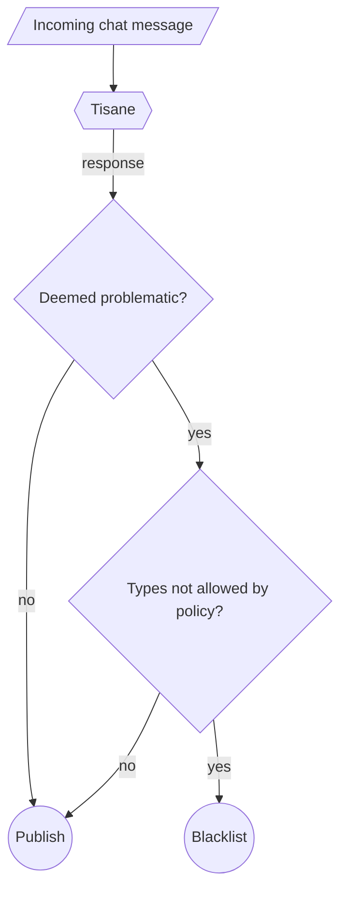

# Kiểm duyệt trò chuyện trực tiếp

Tisane được sử dụng rộng rãi để kiểm duyệt các cuộc trò chuyện trực tiếp giữa người dùng trên các nền tảng nhắn tin nhóm. Thông thường, trong các cuộc trò chuyện trực tiếp, Tisane hoạt động ở chế độ hoàn toàn tự động. 

Nếu việc phát hiện sai là một vấn đề nhạy cảm, thì có thể thiết lập quy trình khiếu nại và xem xét thủ công (theo yêu cầu).

## Kiến trúc tích hợp tiêu chuẩn

Như thể hiện trong sơ đồ bên dưới: một kiến trúc tích hợp đơn giản quét mọi tin nhắn và đưa vào danh sách đen hoặc chuyển tin nhắn đó đến một kênh đặc biệt nếu bị coi là có vấn đề và chính sách không cho phép loại hành vi `abuse` đã được phát hiện.

1. Ứng dụng phía khách gửi các bài đăng đến Tisane để quét.
2. Tisane gắn cờ bài đăng dựa trên mức độ nghiêm trọng và loại hành vi lạm dụng.
3. Sau đó, ứng dụng khách cần kiểm tra xem các loại hành vi được ghi nhận trong phần `abuse` có bị cấm theo chính sách cộng đồng hay không.
4. Nếu có các loại bị cấm, bài đăng sẽ bị đưa vào danh sách đen. (Thông thường, bài đăng sẽ được chuyển đến một kênh riêng cho quản trị viên. Vì lý do bảo trì, không nên xóa hoàn toàn tin nhắn mà không để lại dấu vết.)
5. Nếu không có loại bị cấm, hoặc phần phản hồi của Tisane không có phần `abuse`, thì bài đăng sẽ được công bố.

## Tích hợp mã nguồn mở

Đối tác PubNub của chúng tôi đã xây dựng bản demo kiểm duyệt nội dung tích hợp mượt mà với Tisane và công khai mã nguồn trên GitHub. Triển khai này cho phép người dùng thiết lập chính sách kiểm duyệt cộng đồng một cách linh hoạt. 

- [Bảng điều khiển kiểm duyệt cho trò chuyện của PubNub](https://www.pubnub.com/demos/moderation-dashboard/)
- [pubnub/moderation-dashboard trên GitHub](https://github.com/pubnub/moderation-dashboard)

## Tích hợp với các nền tảng phổ biến

Xem phần: [Tích hợp - Tisane Labs](https://tisane.ai/integrations)

