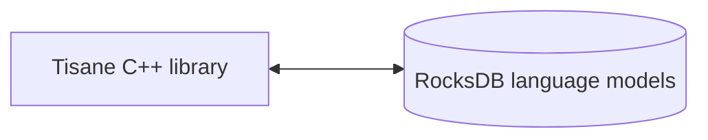

# Tài liệu tham khảo C/C++ cho Tisane Embedded

## Tổng quan

Hướng dẫn này cung cấp tài liệu tham khảo về các phương pháp có sẵn trong Bộ công cụ phát triển phần mềm (SDK) Tisane Embedded cho các ứng dụng C/C++. 

### Thành phần

Về cơ bản, Tisane runtime giao tiếp trực tiếp với các mô hình ngôn ngữ Tisane được lưu trữ trong kho lưu trữ RocksDB. Không cần sử dụng hoặc cài đặt hệ thống quản lý cơ sở dữ liệu bên ngoài.



#### Các hệ điều hành nhị phân

##### Windows

- Thư viện runtime:
- 
  - `libTisane.dll`: Tisane runtime cốt lõi.
  - `libgcc_s_seh-1.dll`: Thư viện POSIX C/C++ chuẩn.
  - `libstdc++-6.dll`: Thư viện POSIX C/C++ chuẩn.
  - `libwinpthread-1.dll`: Thư viện POSIX C/C++ chuẩn.

##### Linux

- tisane: Chương trình thực thi cốt lõi của Tisane.

#### Mô hình ngôn ngữ

Xem phần: [Kho dữ liệu mô hình ngôn ngữ](./languagemodels.md) 

## Yêu cầu

### Nền tảng

#### Windows
Windows 10+ (64-bit)



Các phiên bản Windows cũ hơn có thể hoạt động nhưng không được hỗ trợ chính thức 



#### Linux

Kernel phiên bản 6.0.0 trở lên

### RAM

**Tải chậm**: 50 Mb cố định + 50 đến 100 Mb cho mỗi mô hình ngôn ngữ

**Tải đầy đủ**: từ 400 Mb đến 2 Gb cho mỗi mô hình ngôn ngữ

Đọc thêm: [Chế độ Tải chậm so với chế độ Tải đầy đủ](./lazyloading.md)

## Tích hợp

### Luồng công việc cơ bản

1. `SetDbPath` – Thiết lập đường dẫn dữ liệu.
2. `LoadAnalysisLanguageModel` – Tải mô hình ngôn ngữ mong muốn.
3. `Parse` – Phân tích văn bản

### Cài đặt và sử dụng

1. Bao gồm tệp tiêu đề:  
  *  Hãy đảm bảo bạn bao gồm tệp tiêu đề cần thiết ([`tisane.h`](./tisane.h)) trong dự án C/C++ của mình. 
  *  Tệp này sẽ chứa các khai báo hàm.

2. Liên kết ứng dụng của bạn với thư viện Tisane (ví dụ: `tisane.so` hoặc `libTisane.dll`).  

3. Khởi tạo:

  * Thiết lập đường dẫn dữ liệu: 

      *   Lệnh *gọi* đầu tiên bạn *phải* thực hiện là đến `SetDbPath`.  
      *   Thao tác này cho SDK biết nơi tìm tệp dữ liệu mô hình ngôn ngữ.

  *   Tải mô hình ngôn ngữ:  
      *   Gọi `LoadAnalysisLanguageModel` để tải mô hình ngôn ngữ mong muốn.  
      *   Gọi *sau khi* `SetDbPath`
      *   Việc tải toàn bộ mô hình ngôn ngữ có thể mất thời gian, đặc biệt là đối với các mô hình lớn.
  *   Nếu có kế hoạch chuyển đổi (ví dụ: dịch), hãy tải mô hình ngôn ngữ tạo sinh:
      *   Gọi `LoadGenerationLanguageModel` để tải mô hình ngôn ngữ mong muốn cho ngôn ngữ đích. 
4.   Quy trình:
  *   Phân tích cú pháp văn bản: 
    *   Sử dụng hàm `Parse` để phân tích văn bản bằng các cài đặt được chỉ định: 
        *   `language`: Mã ngôn ngữ chuẩn ISO-639-1 (ví dụ: "en", "zh-CN"), danh sách mã ngôn ngữ phân cách bằng gạch đứng hoặc dấu `*` để phát hiện tự động.
        *   `content`: Văn bản UTF-8 để phân tích cú pháp.
        *   `settings`: Chuỗi JSON với các cài đặt. (Xem phần: [Hướng dẫn phản hồi và cấu hình](../apis/tisane-api-response-guide.md)).`
        *   `Returns`: Chuỗi JSON (Xem phần: [Hướng dẫn phản hồi và cấu hình](../apis/tisane-api-response-guide.md)).
    
  *   Phát hiện ngôn ngữ: 
    *   Sử dụng hàm `DetectLanguage` để xác định ngôn ngữ của một văn bản nhất định.
        *   `content`: Văn bản UTF-8.
        *   `likelyLanguages`: (Tùy chọn) Ngôn ngữ dự kiến.
        *   `segmentDelimiter`: (Tùy chọn) Phân tách các phần của văn bản để phát hiện ngôn ngữ. Mặc dù có thể phát hiện nhiều ngôn ngữ khác nhau mà không cần chỉ định rõ ràng dấu phân cách, nhưng dấu phân cách cho phép kiểm soát kết quả tốt hơn.
        *   `Returns`: Mã ngôn ngữ được phát hiện.
    
  *   Chuyển đổi văn bản:  
    *   Sử dụng hàm `Transform` để dịch hoặc diễn giải một chuỗi từ ngôn ngữ này sang ngôn ngữ khác. 
        *   `sourceLanguage`: Mã ngôn ngữ chuẩn ISO-639-1 (ví dụ: "en", "zh-CN"), danh sách mã ngôn ngữ phân cách bằng gạch đứng hoặc dấu `*` để phát hiện tự động.
        *   `targetLanguage`: Mã ngôn ngữ cần dịch hoặc danh sách mã ngôn ngữ được phân cách bằng dấu gạch đứng.
        *   `content`: Văn bản UTF-8 cần chuyển đổi.
        *   `settings`: Chuỗi JSON.
        *   `Returns`: Văn bản đã chuyển đổi, nếu một ngôn ngữ đích được chỉ định; một mảng JSON chứa bản dịch, nếu nhiều ngôn ngữ được chỉ định.


Xem thêm phần: 

- [Hướng dẫn cấu hình và phản hồi API](../apis/tisane-api-response-guide.md)


## Tham chiếu hàm

### SetDbPath

```cpp
__stdcall void SetDbPath(const char *dataRootPath);
```

Xác định đường dẫn gốc đến các tệp dữ liệu mô hình ngôn ngữ. Phải gọi hàm này trước khi sử dụng bất kỳ hàm Tisane SDK nào khác.

* `dataRootPath`: Chuỗi kiểu C kết thúc bằng ký tự null biểu thị đường dẫn tuyệt đối hoặc tương đối đến thư mục chứa dữ liệu mô hình ngôn ngữ.

Giá trị trả về: 

Không có.

Ví dụ:

```cpp
SetDbPath("C:\\Tisane");
```
### LoadAnalysisLanguageModel

```cpp
__stdcall void LoadAnalysisLanguageModel(const char *languageCode);
```

Tải mô hình ngôn ngữ để sử dụng theo phương pháp `Parse` hoặc làm ngôn ngữ nguồn trong phương pháp `Transform`.

Tham số:

* `languageCode`: Chuỗi kiểu C kết thúc bằng ký tự null biểu thị mã ngôn ngữ. Ví dụ: `"en"` là tiếng  Anh, `"es"` là tiếng Tây Ban Nha.

Giá trị trả về: 

Không có.

Ví dụ:

```cpp
LoadAnalysisLanguageModel("en");
```
### LoadGenerationLanguageModel
```cpp
__stdcall void LoadGenerationLanguageModel(const char *languageCode);
```

Tải mô hình ngôn ngữ để sử dụng làm mô hình ngôn ngữ đích cho các tác vụ tạo văn bản như dịch và diễn giải.



Các mô hình tạo sinh luôn được tải ở chế độ chậm.



Tham số:

* `languageCode`: Chuỗi kiểu C kết thúc bằng ký tự null biểu thị mã ngôn ngữ.

Giá trị trả về: 

Không có.

Ví dụ:

```cpp
LoadGenerationLanguageModel("fr"); // Load French for translation
```

### LoadCustomizedAnalysisLanguageModel
```cpp
__stdcall void LoadCustomizedAnalysisLanguageModel(const char *languageCode, const char *customizationSuffix);
```

Tải một mô hình ngôn ngữ tùy chỉnh. Thao tác này cho phép mở rộng mô hình ngôn ngữ cơ sở với vốn từ vựng hoặc logic cụ thể theo từng lĩnh vực. Mô hình ngôn ngữ tùy chỉnh được chạy cùng với mô hình ngôn ngữ chính và được ưu tiên hơn các định nghĩa của mô hình chính.

Tham số:

* `languageCode`: Mã ngôn ngữ của mô hình ngôn ngữ cơ sở.

- `customizationSuffix`: Hậu tố xác định mô hình bổ sung tùy chỉnh cụ thể. SDK sẽ tìm kiếm thư mục có tên được chỉ định trong thư mục gốc hiện tại.

Giá trị trả về: 

Không có.

Ví dụ:

```cpp
SetDbPath("C:\\Tisane");
LoadCustomizedAnalysisLanguageModel("en", "medical"); // Load a customized English model for the medical domain
// Tisane will look for additional language models under C:\\Tisane\\medical\\
```

### UnloadAnalysisLanguageModel
```cpp
__stdcall void UnloadAnalysisLanguageModel(const char *languageCode);
```

Dỡ bỏ mô hình ngôn ngữ phân tích đã tải trước đó khỏi bộ nhớ. 

Tham số:

* `languageCode`: Mã ngôn ngữ của mô hình cần dỡ bỏ.

Giá trị trả về: 

Không có.

Ví dụ:

```cpp
UnloadAnalysisLanguageModel("en");
```

### SetProgressCallback
```cpp
void SetProgressCallback(void __stdcall ptrProgressCallback(double));
```

Đặt hàm gọi lại để nhận cập nhật tiến trình trong quá trình tải mô hình ngôn ngữ. Thao tác này hữu ích trong việc cung cấp phản hồi trực quan cho người dùng trong quá trình tải, có thể mất khá nhiều thời gian.

Tham số:

* `ptrProgressCallback`: Con trỏ tới một hàm chấp nhận một tham số kiểu double. Giá trị double sẽ nằm trong khoảng từ 0,0 đến 1,0, biểu diễn tiến trình tải (0,0 = 0%, 1,0 = 100%).

Giá trị trả về: 

Không có.

Ví dụ:

```cpp
#include <iostream>

void __stdcall MyProgressCallback(double progress) {
    std::cout << "Loading progress: " << (progress * 100) << "%" << std::endl;
}

int main() {
    SetProgressCallback(MyProgressCallback);
    // ... load language model ...
    return 0;
}
```

### SetParseProgressCallback
```cpp
void SetParseProgressCallback(bool __stdcall ptrParseProgressCallback(double));
;
```

Đặt hàm gọi lại để nhận thông tin cập nhật tiến trình trong quá trình xử lý. Thao tác này hữu ích trong việc cung cấp phản hồi trực quan cho người dùng trong quá trình phân tích cú pháp dài và cho phép người dùng hủy quá trình xử lý.

Khi quá trình xử lý bị hủy, kết quả một phần được trả về, với một phần bổ sung 
`interrupted` attribute set to `true` in the response JSON.

Tham số:

* `ptrParseProgressCallback`: Con trỏ tới một hàm chấp nhận một tham số kiểu double và trả về một giá trị boolean. Giá trị double sẽ nằm trong khoảng từ 0,0 đến 1,0, biểu diễn tiến trình tải (0,0 = 0%, 1,0 = 100%). Giá trị boolean cho biết liệu vòng lặp xử lý có nên bị gián đoạn hay không. Khi thoát ra, Tisane tóm tắt tất cả các câu cho đến thời điểm đó và trả về phản hồi như bình thường.

Giá trị trả về: 

Không có.

Ví dụ:

```cpp
#include <iostream>

bool MyParseProgressCallback(double progress) {
    std::cout << "Progress: " << progress << "%. Abort? Y/N" << std::endl;
    char answer;
    std::cin.get(answer);
    return std::toupper(answer) == 'Y';
}


int main() {
    SetDbPath("C:\\Tisane");
    ActivateLazyLoading(); // it's a test, we don't want to load the entire model for a tiny piece of text to be processed
    LoadAnalysisLanguageModel("en");
    SetParseProgressCallback(MyParseProgressCallback);
    cout << "\n" << Parse("en", "This is a test. This is a test. This is a test. This is a test. ", "{\"parses\":true, \"words\":true}" << std::endl);   
    return 0;
}
```
### ActivateLazyLoading

```cpp
void ActivateLazyLoading();
```
Kích hoạt chế độ tải chậm.

Đọc thêm: [Chế độ Tải chậm so với chế độ Tải đầy đủ](./lazyloading.md)


Tham số: 

Không có.

Giá trị trả về: 

Không có.

Ví dụ:

```cpp
ActivateLazyLoading();
```

### IsLazyLoadingActive
```cpp
bool IsLazyLoadingActive();
```

Kiểm tra xem chế độ tải chậm có đang hoạt động hay không.

Tham số: 

Không có.

Giá trị trả về:

- `true` nếu chế độ tải chậm đang hoạt động, 
- `false` nếu ngược lại.

Ví dụ:

```cpp
if (IsLazyLoadingActive()) {
    std::cout << "Lazy loading is active." << std::endl;
}
```

### Phân tích cú pháp
```cpp
const char* Parse(const char *language, const char *content, const char *settings);
```

Phân tích cú pháp nội dung văn bản đã cho bằng cách sử dụng mô hình ngôn ngữ và cài đặt được chỉ định.

Tham số:

* `language`: Mã ngôn ngữ của ngôn ngữ cần phân tích cú pháp.
* `content`: Văn bản cần phân tích cú pháp (được mã hóa UTF-8).
* `settings`: Một chuỗi JSON xác định các tính năng phân tích mong muốn. Xem phần Thông số cài đặt để biết chi tiết.

Giá trị trả về:  

Một `const char*` chứa chuỗi JSON biểu diễn kết quả phân tích. Không cần giải phóng bộ nhớ. Trả về `nullptr` nếu thất bại.


Mã mẫu:

```cpp
  SetDbPath("C:\\Tisane");
  ActivateLazyLoading(); // it's a test, we don't want to load the entire model for a tiny piece of text to be processed
  LoadAnalysisLanguageModel("en");
  cout << "\n" << Parse("en", "This is a test.", "{\"parses\":true, \"words\":true}");
```


Xem phần: [Phản hồi](../apis/tisane-api-response-guide.md).

### ParseTextFile
```cpp
const char* ParseTextFile(const char *language, const char *filename, uint32_t chunkSize, const char *settings);
```

Phân tích cú pháp nội dung từ tệp văn bản được chỉ định bằng ngôn ngữ được chỉ định bằng cách sử dụng các cài đặt được chỉ định theo từng khối. Chỉ tải khối đang được xử lý.

Tham số:

* `language`: Mã ngôn ngữ của ngôn ngữ cần phân tích cú pháp.
* `filename`: Tệp văn bản cần phân tích cú pháp (được mã hóa UTF-8). Được giả định chỉ chứa văn bản.
* `chunkSize`: Kích thước của các khối được sử dụng để đọc luồng từ tệp. Nếu bằng 0, thì 8192 byte sẽ được chỉ định.
* `settings`: Một chuỗi JSON xác định các tính năng phân tích mong muốn. Xem phần Thông số cài đặt để biết chi tiết.

Giá trị trả về:  

Một `const char*` chứa chuỗi JSON biểu diễn kết quả phân tích. Không cần giải phóng bộ nhớ. Trả về `nullptr` nếu thất bại.



Văn bản sẽ bị lược bỏ khỏi phản hồi đối với các tệp lớn hơn vì mục đích hiệu suất.



Mã mẫu:

```cpp
  SetDbPath("C:\\Tisane");
  ActivateLazyLoading(); // it's a test, we don't want to load the entire model for a tiny piece of text to be processed
  LoadAnalysisLanguageModel("en");
  std::string result = ParseTextFile("en", "myinputfile.txt", 8192, "{}");
```

### DetectLanguage

```cpp
__stdcall const char* DetectLanguage(const char *content, const char *likelyLanguages, const char* segmentDelimiter);
```
Phát hiện ngôn ngữ của nội dung văn bản được cung cấp.

Tham số:

* `content`: Văn bản cần phân tích (được mã hóa UTF-8).
* `likelyLanguages`: (Tùy chọn) Danh sách các mã ngôn ngữ được phân tách bằng dấu phẩy có khả năng xuất hiện trong văn bản. Điều này có thể cải thiện độ chính xác của việc phát hiện. Truyền nullptr nếu không cần thiết.
* `segmentDelimiter`: (Tùy chọn) Một chuỗi được sử dụng để phân định các phân đoạn trong văn bản. Đối với mỗi phân đoạn, việc phát hiện sẽ được thực hiện riêng biệt. Truyền nullptr cho hành vi mặc định.

Giá trị trả về: 

Một `const char*` chứa một chuỗi JSON biểu diễn (các) ngôn ngữ được phát hiện. Trả về `nullptr` nếu thất bại.



Không giải phóng bộ nhớ. Bộ nhớ được quản lý nội bộ.



Ví dụ:
```cpp
const char* detectedLanguage = DetectLanguage("Bonjour le monde!", nullptr, nullptr);
if (detectedLanguage) {
    std::cout << "Detected Language: " << detectedLanguage << std::endl;
    // free memory
}
```

### Chuyển đổi
```cpp
__stdcall const char* Transform(const char * sourceLanguage, const char * targetLanguage,const char * content, const char * settings);
```
Dịch hoặc diễn giải một chuỗi từ ngôn ngữ này sang ngôn ngữ khác. 

Yêu cầu cả mô hình ngôn ngữ nguồn và ngôn ngữ đích đều được tải bằng`LoadGenerationLanguageModel`.

Tham số:

* `sourceLanguage`: Mã ngôn ngữ của ngôn ngữ nguồn.
* `targetLanguage`: Mã ngôn ngữ của ngôn ngữ đích.
* `content`: Văn bản cần chuyển đổi (được mã hóa UTF-8).
* `settings`: Một chuỗi JSON xác định các tùy chọn chuyển đổi mong muốn. 

Xem thêm phần: 

- [Hướng dẫn cấu hình và phản hồi API](../apis/tisane-api-response-guide.md)
- [Hướng dẫn cấu hình và tùy chỉnh](../apis/tisane-api-configuration.md)

Giá trị trả về: 

Một `const char*` chứa văn bản đã được dịch hoặc diễn giải. Không cần giải phóng bộ nhớ.  Trả về `nullptr` nếu thất bại.

Ví dụ:
```cpp
  SetDbPath("C:\\Tisane");
  ActivateLazyLoading(); // it's a test, we don't want to load the entire model for a tiny piece of text to be processed
  LoadAnalysisLanguageModel("fr");
  LoadGenerationLanguageModel("en");
  const char* translatedText = Transform("fr", "en", "bonjour!", "{}");
  if (translatedText) {
    std::cout << "Translated Text: " << translatedText << std::endl;
    // free memory
  }
```
