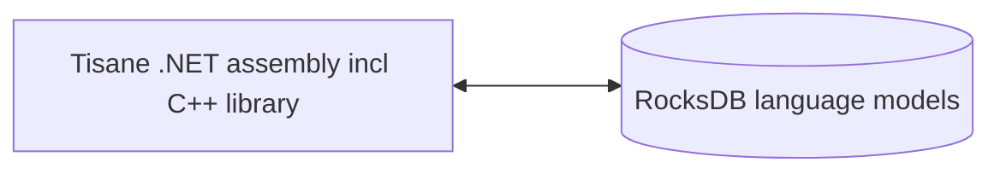

# Tài liệu tham khảo .NET cho Tisane Embedded

## Tổng quan

Tisane Embedded cho phép tích hợp khả năng xử lý ngôn ngữ tự nhiên (NLP) của Tisane trực tiếp vào các ứng dụng .NET trên máy tính để bàn và máy chủ của bạn. 

Hướng dẫn này cung cấp tài liệu tham khảo về các phương pháp có sẵn trong Bộ công cụ phát triển phần mềm (SDK) Tisane Embedded cho các ứng dụng .NET.

### Thành phần

Về cơ bản, Tisane runtime giao tiếp trực tiếp với các mô hình ngôn ngữ Tisane được lưu trữ trong kho lưu trữ RocksDB. Không cần cài đặt bất kỳ công cụ cơ sở dữ liệu máy khách-máy chủ nào.



#### Các hệ điều hành nhị phân

- Thư viện runtime:
- 
  - `libTisane.dll`: Tisane runtime cốt lõi, có thư viện RocksDB nhúng.
  - `libgcc_s_seh-1.dll`: Thư viện POSIX C/C++ chuẩn.
  - `libstdc++-6.dll`: Thư viện POSIX C/C++ chuẩn.
  - `libwinpthread-1.dll`: Thư viện POSIX C/C++ chuẩn.

- Các tệp đóng gói .NET:
  - `Tisane.Runtime.dll` – Phiên bản .NET bao bọc thư viện cốt lõi.  Đây là phiên bản chính mà bạn sẽ tham chiếu trong dự án .NET của mình.
  - `native/amd64/rocksdb.dll` – Cổng Windows của RocksDB.
  - `RocksDbSharp.dll`: Các tệp đóng gói .NET cho RocksDB.
  - `netstandard.dll`: Phiên bản .NET chuẩn.
  - `Newtonsoft.Json.dll`:  Phiên bản phân tích cú pháp JSON.
  - `System.*.dll`, `Microsoft.*.dll`:  Các phiên bản .NET chuẩn khác.

#### Mô hình ngôn ngữ

Xem phần: [Kho dữ liệu mô hình ngôn ngữ](./languagemodels.md) 

### Yêu cầu

#### Runtime

ASP.NET Core Runtime 8 trở lên

#### RAM

**Tải chậm**: 50 Mb cố định + 50 đến 100 Mb cho mỗi mô hình ngôn ngữ

**Tải đầy đủ**: từ 400 Mb đến 2 Gb cho mỗi mô hình ngôn ngữ

Đọc thêm: [Chế độ Tải chậm so với chế độ Tải đầy đủ](./lazyloading.md)

## Triển khai

Trích xuất nội dung của gói phân phối vào thư mục bạn chọn. 

Đảm bảo cài đặt `DbPath` chứa tên thư mục dữ liệu là chính xác. 



Các phiên bản .NET Tisane sử dụng cấu hình `ConfigurationManager` (XML). Tên của tệp cấu hình là: `tên tệp thực thi không có phần mở rộng` + `.dll.config`.

Ví dụ: nếu tệp thực thi của bạn là `Tisane.TestConsole.Desktop.exe`, thì cấu hình là `Tisane.TestConsole.Desktop.dll.config`.



#### Phương pháp cốt lõi

##### Phân tích cú pháp

```c#
string Parse(string language, string content, string settings)
```

Phân tích văn bản và trả về cấu trúc JSON có kết quả.

- `language`: Mã ngôn ngữ để phân tích. Sử dụng `*` để tự động phát hiện ngôn ngữ hoặc danh sách các mã ngôn ngữ được phân cách bằng dấu gạch ngang (ví dụ: `de|fr|ja`).
- `content`: Văn bản cần phân tích.
- `settings`: Một đối tượng JSON xác định các cài đặt phân tích. Xem phần [Hướng dẫn cấu hình và tùy chỉnh](../apis/tisane-api-configuration.md).

Trả về: Một đối tượng phản hồi JSON.

Ví dụ:

```c#
string result = Tisane.Server.Parse("en", "What a lovely day", "{}");
Console.WriteLine(result);
```

Xem thêm phần: 
 
* [Hướng dẫn về phản hồi](../apis/tisane-api-response-guide.md)

##### Chuyển đổi

```c#
string Transform(string sourceLanguage, string targetLanguage, string content, string settings)
```

Dịch hoặc diễn đạt lại văn bản.

- `sourceLanguage`:  Mã ngôn ngữ của văn bản đầu vào. Sử dụng `*` hoặc một danh sách phân cách bằng dấu gạch ngang (ví dụ: `de|fr|ja`) để tự động phát hiện ngôn ngữ.
- `targetLanguage`: Mã ngôn ngữ đích
- `content`: Văn bản cần chuyển đổi
- `settings`: Một đối tượng JSON xác định các cài đặt chuyển đổi. Xem phần [Hướng dẫn cấu hình và tùy chỉnh](../apis/tisane-api-configuration.md).

Trả về: Một văn bản đã được chuyển đổi/dịch.

Xem thêm phần: 

- [Hướng dẫn cấu hình và phản hồi API](../apis/tisane-api-response-guide.md)

Ví dụ:

```c#
string result = Tisane.Server.Transform("fr", "en", "Bonjour!", "{}");
Console.WriteLine(result);
```

##### DetectLanguage

```c#
string DetectLanguage(string content, string likelyLanguages, string delimiter)
```

Xác định ngôn ngữ trong văn bản.

- `content`: Văn bản cần phân tích
- `likelyLanguages`: Danh sách phân cách bằng dấu gạch ngang của các mã ngôn ngữ có thể xuất hiện (ví dụ: de|fr|ja). Sử dụng *, ?,  hoặc một chuỗi rỗng nếu ngôn ngữ là không xác định.
- `delimiter`: Loại phân cách tùy chỉnh tùy chọn (biểu thức chính quy, kiểu Google RE2) để phân đoạn văn bản. Ví dụ:  câu, đoạn văn. Nếu bỏ qua, toàn bộ nội dung sẽ được phân tích dưới dạng một khối duy nhất.

Ví dụ:

```c#
string text = "This is English.  C'est français.";
string likelyLanguages = "en|fr";
string delimiter = @"\. "; // Split on sentences
string result = Tisane.Server.DetectLanguage(text, likelyLanguages, delimiter);
Console.WriteLine(result);
```

#### Các phương pháp truy cập mô hình ngôn ngữ

Các phương pháp này cho phép bạn truy vấn và kiểm tra nội dung của các mô hình ngôn ngữ.

##### GetFamilyData

```c#
string GetFamilyData(int id)
```

Trả về một tài liệu JSON chứa mô tả và các thuộc tính của họ.

- `id`: ID của họ cần truy xuất.

##### ListSenses

```c#
string ListSenses(string language, string word)
```

Liệt kê các họ từ có liên kết với một từ, kèm theo ID, mô tả và tính năng. Trả về một tài liệu JSON (Stream).

- `language`: Mã ngôn ngữ. *Không hỗ trợ phát hiện ngôn ngữ tự động.*
- `word`: Từ (hoặc biểu thức gồm nhiều từ) cần tra cứu. Có thể là một dạng biến cách, không nhất thiết phải là từ gốc.

##### ListHypernyms

```c#
string ListHypernyms(int family, int maxLevel)
```

Trả về một tài liệu JSON chứa các thượng vị (thuật ngữ rộng hơn) cho một họ nhất định.

- `family`: ID của họ cần liệt kê các thượng vị.
- `maxLevel`: Số lượng cấp độ tối đa có thể di chuyển lên trên trong hệ thống phân cấp thượng vị.

##### GetInflectedForms

```c#
string GetInflectedForms(string language, int lexeme, int family)
```

Trả về một đối tượng JSON chứa các dạng biến cách (biến thể của một từ) được liên kết với một trị từ vựng và họ.

- `language`: Mã ngôn ngữ. *Không hỗ trợ phát hiện ngôn ngữ tự động.*
- `lexeme`: ID của trị từ vựng.
- `family`: ID của họ.

#### Phương pháp dọn dẹp

Đây là các phương pháp hỗ trợ để trích xuất hoặc dọn dẹp văn bản cần phân tích cú pháp.

##### Chuẩn hóa

```c#
string Normalize(string dirtyText)
```

Trả về văn bản đã được dọn dẹp bằng cách loại bỏ các hiện tượng OCR, tiêu đề/chữ ký email và các đoạn văn bản mẫu khác.

- `dirtyText`: Văn bản cần dọn dẹp.

##### ExtractText

```c#
string ExtractText(string webpageText)
```

Trích xuất nội dung văn bản thuần túy từ trang web, loại bỏ mã HTML.

- `webpageText`: Nội dung HTML của một trang web.

Trả về: văn bản được trích xuất.