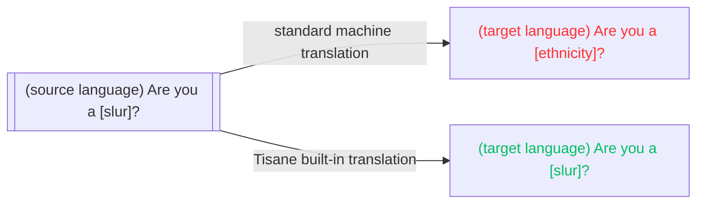

# Built-in Translation

Tisane provides machine translation capability, primarily for explanatory purposes. The translation uses the same language models as those used for analytical purposes, which guarantees consistent results. 

To use translation, invoke `POST /transform`. The response is plain text (translation of the original utterance).

See: [Translate Text](/apis/tisane-api-short/nlu-nlp-methods/transform).

## Standard Machine Translation vs Tisane Machine Translation

Standard machine translation engines (Google Translate, Microsoft Translator, DeepL) are primarily used to translate content in order to publish it. State of the art engines, while being able to handle diverse varieties of content, are only trained on small amounts of obscenities and slurs. For commercial reasons, they are mostly used to translate technical, scentific texts, official pronouncement, or news.

In order to avoid scandals and lawsuits, slurs and obscenities are underprioritized and removed, when possible. Often, "please" is added to requests even if it doesn't exist.

That means that **the emotional component is not preserved**. If, say, the original text contained a slur, the standard machine translation will likely not. Moderators of global communities, using standard machine translation, will struggle to understand the people's reaction if the style is modified. (Compare: "are you an [ethnicity]?" vs "are you a [slur]?")

Another issue is that standard machine translation does not handle obfuscated words well. 

That is why we created machine translation adapted for content moderation and law enforcement needs:

* Tisane machine translation preserves the original emotional component: slurs and profanities in the source language are translated as slurs and profanities in the target language.
* Tisane machine translation can decipher algospeak, since it employs the same analysis process.



## Example

Request:

```json
{
  "from": "fr",
  "to": "en",
  "content": "tu es une taspe",
  "settings": {}
}
```

Response:
```text
you are a bitch
```