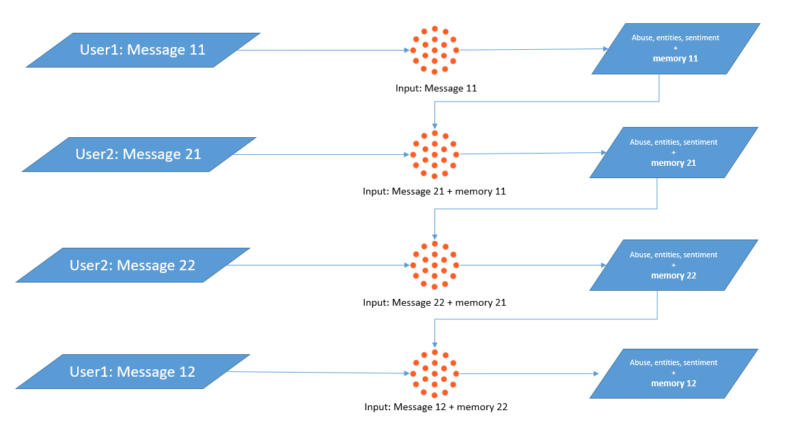

# Considering Previously Processed Messages

By default, Tisane calls are stateless. Which means, Tisane is only aware of the text it receives in the current request. (Within the text though, the context is tracked between sentences for the purposes of co-reference resolution.) This is a deliberate choice both for the simplicity of deployment, and to avoid legal issues with data retention. API call = session.

But what happens if we need to refer to previous messages? In context of problematic content, there are several relevant scenarios, most notably online grooming and fraud, in which the full picture only emerges when several utterances are put together.

Consider the following utterance: “Where are your parents now?” On its own, we don’t have enough context to mark it as problematic. It can be anything: two kids talking about their parents or a repairman trying to locate the head of the household. Then consider another utterance: “Can you turn on your camera?” Once again, the utterance alone does not necessarily imply nefarious intent. It may be from a conversation between colleagues at work.

However, when the request to turn on the camera follows the inquiry about the location of the parents, it works like the binary explosives immortalized by action movies. It’s a very good reason to issue an alert.

To keep the context while keeping Tisane stateless, a module called “long-term memory” is used. The `memory` object in response contains the flags that store intermediate observations. The same portion of the response needs to be included in the subsequent requests under settings (`"memory":{...}`).



To display the content of the memory module, set `state` to `true` in the `settings` structure.



If it’s an ongoing dialogue, then the memory structure of every last processed message must be included in the next request as shown on the diagram below:

Can these memories be changed and edited? Of course, so external context may be introduced as well. Note that the retention of the data is the responsibility of the caller.

See: [Context and Long-Term Memory](/apis/tisane-api-configuration#context-and-long-term-memory)