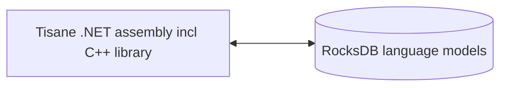

# Tisane Embedded .NET Reference

## Overview

Tisane Embedded enables integrating Tisane's natural language processing (NLP) capabilities directly into your desktop and server .NET applications. 

This guide provides a reference to the methods available in the Tisane Embedded SDK for .NET applications.

### Components

Under the hood, the Tisane runtime directly communicates with Tisane language models stored in RocksDB stores. No client-server database engines need to be installed.



#### Binaries

- Runtime libraries:
- 
  - `libTisane.dll`: The core Tisane runtime, with the embedded RocksDB library.
  - `libgcc_s_seh-1.dll`: Standard POSIX C/C++ library.
  - `libstdc++-6.dll`: Standard POSIX C/C++ library.
  - `libwinpthread-1.dll`: Standard POSIX C/C++ library.

- .NET wrapper files:
  - `Tisane.Runtime.dll` – The .NET assembly that wraps the core library.  This is the primary assembly you'll reference in your .NET project.
  - `native/amd64/rocksdb.dll` – Windows port of RocksDB.
  - `RocksDbSharp.dll`: .NET wrappers for RocksDB.
  - `netstandard.dll`: Standard .NET assembly.
  - `Newtonsoft.Json.dll`:  JSON parsing assembly.
  - `System.*.dll`, `Microsoft.*.dll`:  Other standard .NET assemblies.

#### Language Models

See: [Language Models Data Stores](./languagemodels.md) 

### Requirements

#### Runtime

ASP.NET Core Runtime 8+

#### RAM

**Lazy loading**: 50 Mb fixed + 50 to 100 Mb per language model

**Fully loaded**: between 400 Mb and 2 Gb per language model

Read more: [Lazy loading vs Fully Loaded Mode](./lazyloading.md)

## Deployment

Extract the contents of the distribution package into a directory of your choice. 

Make sure the `DbPath` setting containing the name of the data directory is correct. 



Tisane .NET assemblies use `ConfigurationManager` configurations (XML). The name of the configuration file is: `executable filename without extension` + `.dll.config`.

For example, if your executable is `Tisane.TestConsole.Desktop.exe`, then the configuration is `Tisane.TestConsole.Desktop.dll.config`.



#### Core Methods

##### Parse

```c#
string Parse(string language, string content, string settings)
```

Analyzes text and returns a JSON structure with results.

- `language`: Language code for analysis. Use `*` for language autodetection, or a pipe-delimited list of language codes (e.g., `de|fr|ja`).
- `content`: The text to analyze.
- `settings`: A JSON object defining analysis settings. See [Configuration and Customization Guide](/apis/@l10n/ja/tisane-api-configuration.md).

Returns: A JSON response object.

Example:

```c#
string result = Tisane.Server.Parse("en", "What a lovely day", "{}");
Console.WriteLine(result);
```

Also see: 
 
* [Response guide](/apis/@l10n/ja/tisane-api-response-guide.md)

##### Transform

```c#
string Transform(string sourceLanguage, string targetLanguage, string content, string settings)
```

Translates or paraphrases text.

- `sourceLanguage`:  Language code of the input text. Use `*` or a pipe-delimited list (e.g., `de|fr|ja`) for language autodetection.
- `targetLanguage`: Target language code
- `content`: The text to transform
- `settings`: A JSON object defining transformation settings. See [Configuration and Customization Guide](/apis/@l10n/ja/tisane-api-configuration.md).

Returns: A transformed/translated text.

See also: 

- [API response and configuration guide](/apis/@l10n/ja/tisane-api-response-guide.md)


Example:

```c#
string result = Tisane.Server.Transform("fr", "en", "Bonjour!", "{}");
Console.WriteLine(result);
```

##### DetectLanguage

```c#
string DetectLanguage(string content, string likelyLanguages, string delimiter)
```

Identifies languages in text.

- `content`: The text to analyze
- `likelyLanguages`: Pipe-delimited list of likely language codes (e.g., de|fr|ja). Use *, ?, or an empty string if the languages are unknown).
- `delimiter`: Optional custom delimiter (regular expression, Google RE2 flavor) for chunking the text. For example:  sentence, paragraph. If omitted, the entire content is analyzed as a single chunk.

Example:

```c#
string text = "This is English.  C'est français.";
string likelyLanguages = "en|fr";
string delimiter = @"\. "; // Split on sentences
string result = Tisane.Server.DetectLanguage(text, likelyLanguages, delimiter);
Console.WriteLine(result);
```

#### Language Model Access Methods

These methods allow you to query and inspect contents of the language models.

##### GetFamilyData

```c#
string GetFamilyData(int id)
```

Returns a JSON document with family description and attributes.

- `id`: The ID of the family to retrieve.

##### ListSenses

```c#
string ListSenses(string language, string word)
```

Lists families linked to a word, with IDs, descriptions, and features. Returns a JSON document (Stream).

- `language`:The language code. *Automatic language detection is not supported.*
- `word`: The word (or multi-word expression) to look up. Can be an inflected form, not necessarily the lemma.

##### ListHypernyms

```c#
string ListHypernyms(int family, int maxLevel)
```

Returns a JSON document containing hypernyms (broader terms) for a given family.

- `family`: The ID of the family to list hypernyms for.
- `maxLevel`: The maximum number of levels to traverse upwards in the hypernym hierarchy.

##### GetInflectedForms

```c#
string GetInflectedForms(string language, int lexeme, int family)
```

Returns a JSON object containing inflected forms (variations of a word) linked to a lexeme and family.

- `language`:The language code. *Automatic language detection is not supported.*
- `lexeme`: The ID of the lexeme.
- `family`: The ID of the family.

#### Cleanup Methods

These are helper methods to extract or clean up text to be parsed.

##### Normalize

```c#
string Normalize(string dirtyText)
```

Returns a cleaned up text by removing OCR artifacts, email headers/signatures, and other boilerplate fragments.

- `dirtyText`: The text to clean up.

##### ExtractText

```c#
string ExtractText(string webpageText)
```

Extracts the plain text content from a web page, stripping the HTML markup.

- `webpageText`: The HTML content of a web page.

Returns: extracted text.