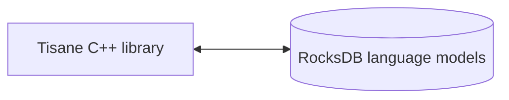

# Tisane Embedded C/C++ Reference

## Overview

This guide provides a reference to the methods available in the Tisane Embedded SDK for C/C++ applications. 

### Components

Under the hood, the Tisane runtime directly communicates with Tisane language models stored in RocksDB stores. No external database engines are involved or need to be installed.



#### Binaries

##### Windows

- Runtime libraries:
- 
  - `libTisane.dll`: The core Tisane runtime.
  - `libgcc_s_seh-1.dll`: Standard POSIX C/C++ library.
  - `libstdc++-6.dll`: Standard POSIX C/C++ library.
  - `libwinpthread-1.dll`: Standard POSIX C/C++ library.

##### Linux

- tisane: The core Tisane executable.

#### Language Models

See: [Language Models Data Stores](./languagemodels.md) 

## Requirements

### Platform

#### Windows
Windows 10+ (64-bit)



Earlier versions of Windows may work but are not officially supported 



#### Linux

Kernel version 6.0.0+

### RAM

**Lazy loading**: 50 Mb fixed + 50 to 100 Mb per language model

**Fully loaded**: between 400 Mb and 2 Gb per language model

Read more: [Lazy loading vs Fully Loaded Mode](./lazyloading.md)

## Integration

### Basic Workflow

1. `SetDbPath` – Set the data path.
2. `LoadAnalysisLanguageModel` – Load the desired language model.
3. `Parse` – Analyze the text.

### Setup And Use

1. Include the header file:  
  *  Ensure you include the necessary header file ([`tisane.h`](./tisane.h)) in your C/C++ project. 
  *  This file will contain the function declarations.

2. Link your application with the Tisane library (e.g., `tisane.so` or `libTisane.dll`).  

3. Initialize:

  * Set the data path: 

      *   The *very first* call you *must* make is to `SetDbPath`.  
      *   This tells the SDK where to find the language model data files.

  *   Load the language model:  
      *   Call `LoadAnalysisLanguageModel` to load the desired language model.  
      *   Call *after* `SetDbPath`
      *   Loading the entire language model can take time, especially for large models.
  *   If planning to transform (e.g. translate), load the generation language model:
      *   Call `LoadGenerationLanguageModel` to load the desired language model for the target language. 
4.   Process:
  *   Parse the text: 
    *   Use the `Parse` function to analyze text using specified settings: 
        *   `language`: A standard ISO-639-1 language code (e.g., "en", "zh-CN"), a vertical-bar delimited list of language codes, or `*` for automatic detection.
        *   `content`: UTF-8 text to parse.
        *   `settings`: JSON string with settings. (See: [The response and configuration guide](/apis/@l10n/vi/tisane-api-response-guide.md)).`
        *   `Returns`: JSON string (See: [The response and configuration guide](/apis/@l10n/vi/tisane-api-response-guide.md) Guide).
    
  *   Detect language: 
    *   Use  the `DetectLanguage` function to identify the language of a given text.
        *   `content`: UTF-8 text.
        *   `likelyLanguages`: (Optional) Expected languages.
        *   `segmentDelimiter`: (Optional) Separates between sections of text to detect language for. While different languages may be detected without an explicitly specified delimiter, the delimiter allows more control over the results.
        *   `Returns`: Detected language codes.
    
  *   Transform text:  
    *   Use the `Transform` function to translate or paraphrase a string from one language to another. 
        *   `sourceLanguage`: A standard ISO-639-1 language code (e.g., "en", "zh-CN"), a vertical-bar delimited list of language codes, or `*` for automatic detection.
        *   `targetLanguage`: A code of a language to translate to, or a vertical-bar delimited list of language codes.
        *   `content`: UTF-8 text to transform.
        *   `settings`: JSON string.
        *   `Returns`: Transformed text, if one target language is specified; a JSON array containing translations, if multiple languages are specified.


See also: 

- [API response and configuration guide](/apis/@l10n/vi/tisane-api-response-guide.md)


## Function Reference

### SetDbPath

```cpp
__stdcall void SetDbPath(const char *dataRootPath);
```

Defines the root path to the language model data files. This function must be called before any other Tisane SDK functions are used.

* `dataRootPath`: A null-terminated C-style string representing the absolute or relative path to the directory containing the language model data.

Return Value: 

None.

Example:

```cpp
SetDbPath("C:\\Tisane");
```
### LoadAnalysisLanguageModel

```cpp
__stdcall void LoadAnalysisLanguageModel(const char *languageCode);
```

Loads a language model to be used by `Parse` method or as a source language in `Transform` method.

Parameters:

* `languageCode`: A null-terminated C-style string representing the language code. For example: `"en"` for English, `"es"` for Spanish.

Return Value: 

None.

Example:

```cpp
LoadAnalysisLanguageModel("en");
```
### LoadGenerationLanguageModel
```cpp
__stdcall void LoadGenerationLanguageModel(const char *languageCode);
```

Loads a language model to be used as a target language model for text generation tasks like translation and paraphrasing.



Generation models are always loaded in lazy mode.



Parameters:

* `languageCode`: A null-terminated C-style string representing the language code.

Return Value: 

None.

Example:

```cpp
LoadGenerationLanguageModel("fr"); // Load French for translation
```

### LoadCustomizedAnalysisLanguageModel
```cpp
__stdcall void LoadCustomizedAnalysisLanguageModel(const char *languageCode, const char *customizationSuffix);
```

Loads a customized language model. This allows extending the base language model with domain-specific vocabulary or logic. The custom language model is run together with the main language model, and takes precedence over the main model's definitions.

Parameters:

* `languageCode`: The language code of the base language model.

- `customizationSuffix`: A suffix that identifies the specific customization add-on model. The SDK will look for a folder with the specified name under the current root folder.

Return Value: 

None.

Example:

```cpp
SetDbPath("C:\\Tisane");
LoadCustomizedAnalysisLanguageModel("en", "medical"); // Load a customized English model for the medical domain
// Tisane will look for additional language models under C:\\Tisane\\medical\\
```

### UnloadAnalysisLanguageModel
```cpp
__stdcall void UnloadAnalysisLanguageModel(const char *languageCode);
```

Unloads a previously loaded analysis language model from memory. 

Parameters:

* `languageCode`: The language code of the model to unload.

Return Value: 

None.

Example:

```cpp
UnloadAnalysisLanguageModel("en");
```

### SetProgressCallback
```cpp
void SetProgressCallback(void __stdcall ptrProgressCallback(double));
```

Sets a callback function to receive progress updates during language model loading. This is useful for providing visual feedback to the user during the loading process, which can take a significant amount of time.

Parameters:

* `ptrProgressCallback`: A pointer to a function that accepts a single double parameter. The double value will be in the range of 0.0 to 1.0, representing the loading progress (0.0 = 0%, 1.0 = 100%).

Return Value: 

None.

Example:

```cpp
#include <iostream>

void __stdcall MyProgressCallback(double progress) {
    std::cout << "Loading progress: " << (progress * 100) << "%" << std::endl;
}

int main() {
    SetProgressCallback(MyProgressCallback);
    // ... load language model ...
    return 0;
}
```

### SetParseProgressCallback
```cpp
void SetParseProgressCallback(bool __stdcall ptrParseProgressCallback(double));
;
```

Sets a callback function to receive progress updates during processing. This is useful for providing visual feedback to the user during long parsing, and allow the user to cancel the processing.

When the processing is cancelled, partial results are returned, with an additional 
`interrupted` attribute set to `true` in the response JSON.

Parameters:

* `ptrParseProgressCallback`: A pointer to a function that accepts a single double parameter and returns a boolean value. The double value will be in the range of 0.0 to 1.0, representing the loading progress (0.0 = 0%, 1.0 = 100%). The boolean value indicates whether the processing loop should be interrupted. Upon exiting, Tisane summarizes all the sentences so far and returns its response normally.

Return Value: 

None.

Example:

```cpp
#include <iostream>

bool MyParseProgressCallback(double progress) {
    std::cout << "Progress: " << progress << "%. Abort? Y/N" << std::endl;
    char answer;
    std::cin.get(answer);
    return std::toupper(answer) == 'Y';
}


int main() {
    SetDbPath("C:\\Tisane");
    ActivateLazyLoading(); // it's a test, we don't want to load the entire model for a tiny piece of text to be processed
    LoadAnalysisLanguageModel("en");
    SetParseProgressCallback(MyParseProgressCallback);
    cout << "\n" << Parse("en", "This is a test. This is a test. This is a test. This is a test. ", "{\"parses\":true, \"words\":true}" << std::endl);   
    return 0;
}
```
### ActivateLazyLoading

```cpp
void ActivateLazyLoading();
```
Activates the lazy loading mode.

Read mode: [Lazy loading vs Fully Loaded Mode](./lazyloading.md)


Parameters: 

None.

Return Value: 

None.

Example:

```cpp
ActivateLazyLoading();
```

### IsLazyLoadingActive
```cpp
bool IsLazyLoadingActive();
```

Checks whether lazy loading mode is currently active.

Parameters: 

None.

Return Value:

- `true` if lazy loading is active, 
- `false` otherwise.

Example:

```cpp
if (IsLazyLoadingActive()) {
    std::cout << "Lazy loading is active." << std::endl;
}
```

### Parse
```cpp
const char* Parse(const char *language, const char *content, const char *settings);
```

Parses the given text content using the specified language model and settings.

Parameters:

* `language`: The language code of the language to parse.
* `content`: The text to parse (UTF-8 encoded).
* `settings`: A JSON string that specifies the desired analysis features. See Settings Specification for details.

Return Value:  

A `const char*` containing a JSON string representing the analysis results. No need to deallocate the memory. Returns `nullptr` on failure.


Example code:

```cpp
  SetDbPath("C:\\Tisane");
  ActivateLazyLoading(); // it's a test, we don't want to load the entire model for a tiny piece of text to be processed
  LoadAnalysisLanguageModel("en");
  cout << "\n" << Parse("en", "This is a test.", "{\"parses\":true, \"words\":true}");
```


See: [Response](/apis/@l10n/vi/tisane-api-response-guide.md).

### ParseTextFile
```cpp
const char* ParseTextFile(const char *language, const char *filename, uint32_t chunkSize, const char *settings);
```

Parse the content from the specified text file in the specified language using the specified settings in chunks. Only loads the chunk being processed.

Parameters:

* `language`: The language code of the language to parse.
* `filename`: The text file to parse (UTF-8 encoded). Assumed to only contain text.
* `chunkSize`: The size of chunks used to read the stream from the file. If 0, then 8192 bytes is assigned.
* `settings`: A JSON string that specifies the desired analysis features. See Settings Specification for details.

Return Value:  

A `const char*` containing a JSON string representing the analysis results. No need to deallocate the memory. Returns `nullptr` on failure.



The text is omitted from the response for larger files for performance purposes.



Example code:

```cpp
  SetDbPath("C:\\Tisane");
  ActivateLazyLoading(); // it's a test, we don't want to load the entire model for a tiny piece of text to be processed
  LoadAnalysisLanguageModel("en");
  std::string result = ParseTextFile("en", "myinputfile.txt", 8192, "{}");
```

### DetectLanguage

```cpp
__stdcall const char* DetectLanguage(const char *content, const char *likelyLanguages, const char* segmentDelimiter);
```
Detects the language of the given text content.

Parameters:

* `content`: The text to analyze (UTF-8 encoded).
* `likelyLanguages`: (Optional) A comma-separated list of language codes that are likely to be present in the text. This can improve detection accuracy. Pass nullptr if not needed.
* `segmentDelimiter`: (Optional) A string used to delimit segments within the text. For every segment, detection will be invoked separately. Pass nullptr for default behavior.

Return Value: 

A `const char*` containing a JSON string representing the detected language(s). Returns `nullptr` on failure.



Do not deallocate the memory. It is managed internally.



Example:
```cpp
const char* detectedLanguage = DetectLanguage("Bonjour le monde!", nullptr, nullptr);
if (detectedLanguage) {
    std::cout << "Detected Language: " << detectedLanguage << std::endl;
    // free memory
}
```

### Transform
```cpp
__stdcall const char* Transform(const char * sourceLanguage, const char * targetLanguage,const char * content, const char * settings);
```
Translates or paraphrases a string from one language to another. 

Requires that both the source and target language models have been loaded using`LoadGenerationLanguageModel`.

Parameters:

* `sourceLanguage`: The language code of the source language.
* `targetLanguage`: The language code of the target language.
* `content`: The text to transform (UTF-8 encoded).
* `settings`: A JSON string that specifies the desired transformation options. 

See also: 

- [API response and configuration guide](/apis/@l10n/vi/tisane-api-response-guide.md)
- [Configuration and customization Guide](/apis/@l10n/vi/tisane-api-configuration.md)

Return Value: 

A `const char*` containing the translated or paraphrased text. You are responsible for freeing the memory allocated for this string.  Returns `nullptr` on failure.

Example:
```cpp
  SetDbPath("C:\\Tisane");
  ActivateLazyLoading(); // it's a test, we don't want to load the entire model for a tiny piece of text to be processed
  LoadAnalysisLanguageModel("fr");
  LoadGenerationLanguageModel("en");
  const char* translatedText = Transform("fr", "en", "bonjour!", "{}");
  if (translatedText) {
    std::cout << "Translated Text: " << translatedText << std::endl;
    // free memory
  }
```
